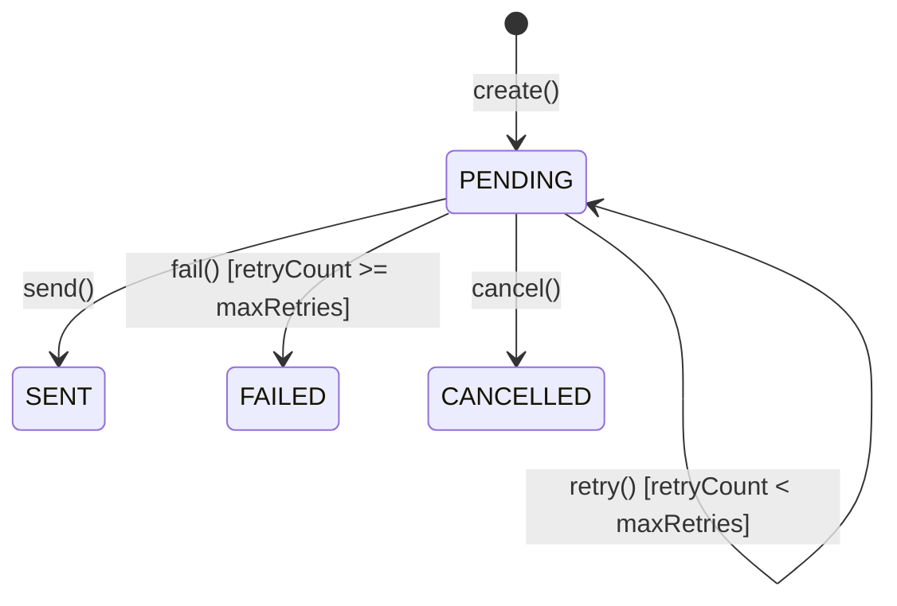

# 1. 目的

Notificationコンテキストは、**システム内イベントに応じたユーザーへの通知配信**を担当する。

## 責務

- 各コンテキストからのドメインイベントを購読し、通知を生成
- 複数チャネル（Email, Push, SMS等）への通知配信
- 通知の配信状態管理とリトライ処理
- 通知テンプレートの管理
- ユーザーの通知設定（オプトアウト）の尊重

## スコープ外

- 通知内容の決定：各コンテキストがイベントペイロードで提供
- ユーザー情報の管理：IAMコンテキストが担当
- リアルタイムチャット：別コンテキスト
- マーケティング通知：別システム

---

# 2. 用語

- SSOT：`docs/domain/glossary.md`
- 主要用語：
  - **Notification**：ユーザーへの通知を表す集約
  - **NotificationStatus**：PENDING | SENT | FAILED | CANCELLED
  - **NotificationChannel**：EMAIL | PUSH | SMS
  - **NotificationType**：通知種別（BOOKING_CREATED, PAYMENT_COMPLETED等）
  - **DeliveryAttempt**：配信試行の記録

---

# 3. 集約一覧（Aggregate Catalog）

## 3.1 Notification（集約ルート）

```
Notification (Aggregate Root) {
  id: NotificationId (UUID)
  userId: UserId (UUID)
  type: NotificationType
  channel: NotificationChannel (EMAIL | PUSH | SMS)
  status: NotificationStatus (PENDING | SENT | FAILED | CANCELLED)
  subject: String (max: 200)
  body: String (max: 10000)
  metadata: Map<String, String> (イベント参照情報等)
  scheduledAt: DateTime? (遅延送信の場合)
  sentAt: DateTime?
  failureReason: String?
  retryCount: Integer (default: 0)
  maxRetries: Integer (default: 3)
  createdAt: DateTime
  updatedAt: DateTime
}
```

### 不変条件

1. `subject` は空でない
2. `body` は空でない
3. `retryCount <= maxRetries`
4. `status == SENT` の場合、`sentAt` は非NULL
5. `status == FAILED` の場合、`failureReason` は非NULL

### 振る舞い

- `create(userId, type, channel, subject, body)`: 通知作成
- `send()`: PENDING → SENT（配信成功）
- `fail(reason)`: PENDING → FAILED（配信失敗、リトライ上限）
- `retry()`: リトライカウント増加、再配信試行
- `cancel()`: PENDING → CANCELLED（キャンセル）

### 状態遷移



## 3.2 DeliveryAttempt（エンティティ）

```
DeliveryAttempt {
  id: DeliveryAttemptId (UUID)
  notificationId: NotificationId (FK)
  attemptNumber: Integer
  attemptedAt: DateTime
  status: AttemptStatus (SUCCESS | FAILED)
  errorCode: String?
  errorMessage: String?
  providerResponse: String? (外部プロバイダのレスポンス)
}
```

### 用途

- 配信履歴の追跡
- デバッグ・トラブルシューティング
- リトライ判定の根拠

## 3.3 NotificationPreference（値オブジェクト）

```
NotificationPreference {
  userId: UserId
  channel: NotificationChannel
  types: Set<NotificationType>
  enabled: Boolean

  // ユーザーが特定チャネル・種別の通知を受け取るか判定
  shouldNotify(type: NotificationType, channel: NotificationChannel): Boolean
}
```

---

# 4. Context Map

```
┌─────────────────┐     ┌─────────────────┐     ┌─────────────────┐
│       IAM       │     │     Booking     │     │     Payment     │
└────────┬────────┘     └────────┬────────┘     └────────┬────────┘
         │                       │                       │
         │ UserLoggedIn          │ BookingCreated        │ PaymentCaptured
         │ AccountLocked         │ BookingConfirmed      │ PaymentFailed
         │                       │ BookingCancelled      │ PaymentRefunded
         │                       │                       │
         └───────────────────────┼───────────────────────┘
                                 │
                                 ▼
                    ┌─────────────────────────────────────┐
                    │           Notification               │
                    │                                      │
                    │  ・イベント購読                       │
                    │  ・通知生成                          │
                    │  ・マルチチャネル配信                 │
                    │  ・リトライ処理                       │
                    └────────┬─────────────────┬──────────┘
                             │                 │
                             │                 │ NotificationSent
                             │                 │ NotificationFailed
                             ▼                 ▼
              ┌─────────────────┐     ┌─────────────────┐
              │  Email Provider │     │      Audit      │
              │  (SendGrid等)   │     │                 │
              └─────────────────┘     │ 監査記録        │
              ┌─────────────────┐     └─────────────────┘
              │  Push Provider  │
              │  (FCM/APNs)     │
              └─────────────────┘
              ┌─────────────────┐
              │  SMS Provider   │
              │  (Twilio等)     │
              └─────────────────┘
```

## 関係性

| 関係 | 種別 | 説明 |
|------|------|------|
| IAM → Notification | Publisher-Subscriber | セキュリティイベントを購読して通知 |
| Booking → Notification | Publisher-Subscriber | 予約イベントを購読して通知 |
| Payment → Notification | Publisher-Subscriber | 決済イベントを購読して通知 |
| Notification → Audit | Publisher-Subscriber | 通知イベントをAuditが記録 |
| Notification → Providers | Customer-Supplier (ACL) | 外部プロバイダとACL経由で連携 |

## 統合パターン

- **イベント購読**：
  - 各コンテキストからのドメインイベントをメッセージキュー経由で受信
  - イベントタイプに応じた通知テンプレートを選択
  - ユーザーの通知設定を確認後、通知を生成

- **外部プロバイダとの統合**（Anti-Corruption Layer）：
  - `NotificationProviderPort` インターフェースで外部依存を抽象化
  - Email: SendGrid, AWS SES等
  - Push: Firebase Cloud Messaging, Apple Push Notification Service
  - SMS: Twilio, AWS SNS等

---

# 5. 永続化

## 5.1 notifications テーブル

| カラム | 型 | 制約 | 説明 |
|--------|-----|------|------|
| id | UUID | PK | 通知ID |
| user_id | UUID | NOT NULL, INDEX | ユーザーID |
| type | VARCHAR(50) | NOT NULL | 通知種別 |
| channel | VARCHAR(20) | NOT NULL | 配信チャネル |
| status | VARCHAR(20) | NOT NULL, DEFAULT 'PENDING' | ステータス |
| subject | VARCHAR(200) | NOT NULL | 件名 |
| body | TEXT | NOT NULL | 本文 |
| metadata | JSONB | NULL | メタデータ |
| scheduled_at | TIMESTAMP | NULL | 予定送信日時 |
| sent_at | TIMESTAMP | NULL | 送信日時 |
| failure_reason | VARCHAR(500) | NULL | 失敗理由 |
| retry_count | INTEGER | NOT NULL, DEFAULT 0 | リトライ回数 |
| max_retries | INTEGER | NOT NULL, DEFAULT 3 | 最大リトライ回数 |
| created_at | TIMESTAMP | NOT NULL | 作成日時 |
| updated_at | TIMESTAMP | NOT NULL | 更新日時 |

**インデックス：**
- `idx_notifications_user_id` ON notifications(user_id) - ユーザーの通知一覧
- `idx_notifications_status_scheduled` ON notifications(status, scheduled_at) WHERE status = 'PENDING' - 送信待ち通知取得
- `idx_notifications_type_created` ON notifications(type, created_at) - 種別別検索

**制約：**
- `CHECK (status IN ('PENDING', 'SENT', 'FAILED', 'CANCELLED'))`
- `CHECK (channel IN ('EMAIL', 'PUSH', 'SMS'))`
- `CHECK (retry_count <= max_retries)`

## 5.2 delivery_attempts テーブル

| カラム | 型 | 制約 | 説明 |
|--------|-----|------|------|
| id | UUID | PK | 試行ID |
| notification_id | UUID | FK(notifications), NOT NULL | 通知ID |
| attempt_number | INTEGER | NOT NULL | 試行番号 |
| attempted_at | TIMESTAMP | NOT NULL | 試行日時 |
| status | VARCHAR(20) | NOT NULL | SUCCESS/FAILED |
| error_code | VARCHAR(50) | NULL | エラーコード |
| error_message | VARCHAR(500) | NULL | エラーメッセージ |
| provider_response | TEXT | NULL | プロバイダレスポンス |

**インデックス：**
- `idx_delivery_attempts_notification` ON delivery_attempts(notification_id)

## 5.3 notification_preferences テーブル

| カラム | 型 | 制約 | 説明 |
|--------|-----|------|------|
| id | UUID | PK | 設定ID |
| user_id | UUID | NOT NULL | ユーザーID |
| channel | VARCHAR(20) | NOT NULL | チャネル |
| type | VARCHAR(50) | NOT NULL | 通知種別 |
| enabled | BOOLEAN | NOT NULL, DEFAULT TRUE | 有効/無効 |
| created_at | TIMESTAMP | NOT NULL | 作成日時 |
| updated_at | TIMESTAMP | NOT NULL | 更新日時 |

**制約：**
- `UNIQUE (user_id, channel, type)` - ユーザー×チャネル×種別で一意

---

# 6. ドメインイベント

## 6.1 NotificationCreated

通知が作成されたときに発行。

```
NotificationCreated {
  eventId: UUID
  aggregateId: NotificationId
  occurredAt: DateTime
  payload: {
    notificationId: UUID
    userId: UUID
    type: String
    channel: String
    status: "PENDING"
  }
}
```

**購読者：** Audit（監査記録）

## 6.2 NotificationSent

通知が正常に配信されたときに発行。

```
NotificationSent {
  eventId: UUID
  aggregateId: NotificationId
  occurredAt: DateTime
  payload: {
    notificationId: UUID
    userId: UUID
    type: String
    channel: String
    sentAt: DateTime
    attemptNumber: Integer
  }
}
```

**購読者：** Audit（監査記録）

## 6.3 NotificationFailed

通知配信が最終的に失敗したときに発行。

```
NotificationFailed {
  eventId: UUID
  aggregateId: NotificationId
  occurredAt: DateTime
  payload: {
    notificationId: UUID
    userId: UUID
    type: String
    channel: String
    failureReason: String
    totalAttempts: Integer
  }
}
```

**購読者：** Audit（監査記録）、監視システム（アラート）

## 6.4 NotificationRetried

リトライが発生したときに発行。

```
NotificationRetried {
  eventId: UUID
  aggregateId: NotificationId
  occurredAt: DateTime
  payload: {
    notificationId: UUID
    attemptNumber: Integer
    nextRetryAt: DateTime
    errorCode: String
  }
}
```

**購読者：** Audit（監査記録）

---

# 7. 非機能（SLO/Obs/Sec）

## 7.1 SLO（Service Level Objectives）

| SLI | 目標値 | 測定方法 |
|-----|--------|----------|
| 配信成功率 | 99.5% | SENT / (SENT + FAILED) |
| 配信レイテンシ（p99） | < 30秒 | 作成から送信完了まで |
| リトライ後成功率 | > 80% | リトライで成功した通知の割合 |

## 7.2 Observability

- **詳細**：`docs/design/observability.md`
- **主要メトリクス**：
  - `notification_created_total{type, channel}` - 通知作成数
  - `notification_sent_total{type, channel}` - 送信成功数
  - `notification_failed_total{type, channel, error_code}` - 送信失敗数
  - `notification_retry_total{type, channel}` - リトライ発生数
  - `notification_delivery_duration_seconds{type, channel}` - 配信所要時間
  - `notification_pending_count{type, channel}` - 送信待ち通知数
  - `notification_provider_request_total{provider, status}` - プロバイダリクエスト数
  - `notification_provider_duration_seconds{provider}` - プロバイダ応答時間

## 7.3 Security

- **詳細**：`docs/design/security.md`
- **主要対策**：
  - PII保護：ログにメールアドレス・電話番号を出力しない
  - テンプレート：XSS対策としてエスケープ処理
  - 認可：ユーザーは自身の通知のみ閲覧可能
  - 監査：全通知操作を監査ログに記録

---

# 8. リトライ戦略

## 8.1 Exponential Backoff

```
リトライ間隔 = baseDelay * 2^(attemptNumber - 1) + jitter

例（baseDelay = 1分）：
  1回目失敗後: 1分 + jitter
  2回目失敗後: 2分 + jitter
  3回目失敗後: 4分 + jitter
```

## 8.2 リトライ対象エラー

| エラー種別 | リトライ | 説明 |
|------------|----------|------|
| NETWORK_ERROR | ✓ | ネットワーク一時障害 |
| TIMEOUT | ✓ | タイムアウト |
| RATE_LIMITED | ✓ | レート制限（長めの待機） |
| INVALID_RECIPIENT | ✗ | 無効な宛先 |
| CONTENT_REJECTED | ✗ | コンテンツ拒否（スパム判定等） |
| UNSUBSCRIBED | ✗ | 購読解除済み |

## 8.3 実装例

```java
@Service
public class NotificationRetryService {

    private static final Duration BASE_DELAY = Duration.ofMinutes(1);
    private static final int MAX_RETRIES = 3;

    public void scheduleRetry(Notification notification, DeliveryAttempt attempt) {
        if (notification.getRetryCount() >= MAX_RETRIES) {
            notification.fail(attempt.getErrorMessage());
            eventPublisher.publish(new NotificationFailed(notification));
            return;
        }

        if (!isRetryable(attempt.getErrorCode())) {
            notification.fail(attempt.getErrorMessage());
            eventPublisher.publish(new NotificationFailed(notification));
            return;
        }

        Duration delay = calculateDelay(notification.getRetryCount());
        notification.retry();
        notification.setScheduledAt(Instant.now().plus(delay));

        eventPublisher.publish(new NotificationRetried(
            notification,
            Instant.now().plus(delay)
        ));
    }

    private Duration calculateDelay(int retryCount) {
        long delayMillis = BASE_DELAY.toMillis() * (long) Math.pow(2, retryCount);
        long jitter = ThreadLocalRandom.current().nextLong(delayMillis / 10);
        return Duration.ofMillis(delayMillis + jitter);
    }

    private boolean isRetryable(String errorCode) {
        return Set.of("NETWORK_ERROR", "TIMEOUT", "RATE_LIMITED")
            .contains(errorCode);
    }
}
```

---

# 9. 通知種別とトリガー

| 通知種別 | トリガーイベント | チャネル | 優先度 |
|----------|------------------|----------|--------|
| BOOKING_CREATED | BookingCreated | EMAIL | 中 |
| BOOKING_CONFIRMED | BookingConfirmed | EMAIL, PUSH | 高 |
| BOOKING_CANCELLED | BookingCancelled | EMAIL, PUSH | 高 |
| BOOKING_REMINDER | (スケジューラ) | EMAIL, PUSH | 中 |
| PAYMENT_COMPLETED | PaymentCaptured | EMAIL | 高 |
| PAYMENT_FAILED | PaymentFailed | EMAIL, PUSH | 高 |
| PAYMENT_REFUNDED | PaymentRefunded | EMAIL | 中 |
| SECURITY_ALERT | AccountLocked, RefreshTokenReplayDetected | EMAIL, SMS | 最高 |
| LOGIN_NEW_DEVICE | UserLoggedIn (新デバイス) | EMAIL | 高 |

---

# 10. ADRリンク

| ADR | タイトル | 状態 |
|-----|----------|------|
| ADR-011 | 通知配信のリトライ戦略 | 作成予定 |
| ADR-012 | 通知チャネルの抽象化 | 作成予定 |

---

# 11. Evidence（根拠）

| 項目 | 根拠 | 備考 |
|------|------|------|
| Exponential Backoff | AWS, Google等の推奨パターン | 業界標準 |
| 最大リトライ3回 | 一般的な設定、運用で調整可能 | 推論 |
| 配信成功率99.5% | Email配信サービスの一般的なSLA | 推論 |

---

# 12. 未決事項

| 項目 | 内容 | 優先度 | 担当 |
|------|------|--------|------|
| 通知プロバイダ選定 | SendGrid / AWS SES / Twilio等 | 高 | 未定 |
| テンプレートエンジン | Thymeleaf / Mustache等 | 中 | 未定 |
| 配信優先度キュー | 高優先度通知の優先配信 | 中 | Phase 2 |
| 多言語対応 | ユーザー言語設定に応じたテンプレート | 低 | Phase 2 |
| バッチ通知 | ダイジェスト配信 | 低 | Phase 2 |
| A/Bテスト | テンプレートのA/Bテスト機能 | 低 | Phase 2 |
