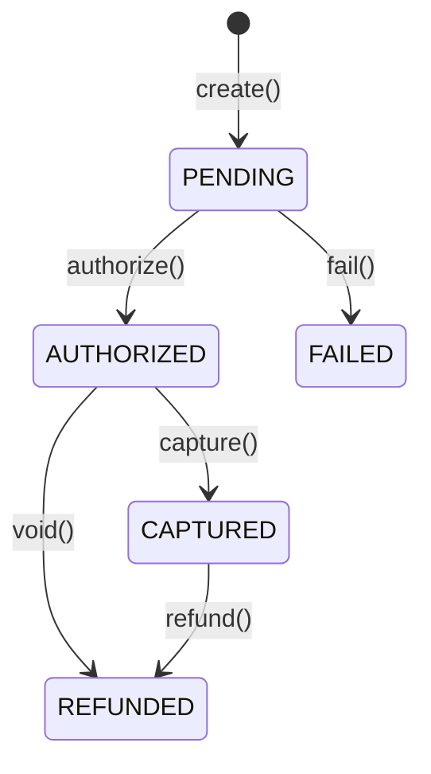

# 1. 目的

Paymentコンテキストは、**予約に対する決済処理**を担当する。

## 責務

- 支払いの作成・与信・キャプチャ・返金
- 冪等性の保証（Idempotency-Keyによる重複処理防止）
- 外部決済ゲートウェイとの連携（Anti-Corruption Layer経由）
- 支払い状態のライフサイクル管理（PENDING → AUTHORIZED → CAPTURED → REFUNDED）
- 決済失敗時のエラーハンドリングとリトライ

## スコープ外

- 予約の管理：Bookingコンテキストが担当
- カード情報の保持：外部決済ゲートウェイが担当（PCI DSS準拠）
- 請求書・領収書の発行：別コンテキストまたは別タスク
- 複数通貨の換算：Phase 2以降

---

# 2. 用語

- SSOT：`docs/domain/glossary.md`
- 主要用語：
  - **Payment**：予約に紐づく決済を表す集約
  - **PaymentStatus**：PENDING | AUTHORIZED | CAPTURED | REFUNDED | FAILED
  - **Money**：金額と通貨を表す値オブジェクト
  - **IdempotencyKey**：重複処理を防ぐためのクライアント生成キー
  - **GatewayTransactionId**：外部決済ゲートウェイのトランザクションID

---

# 3. 集約一覧（Aggregate Catalog）

## 3.1 Payment（集約ルート）

```
Payment (Aggregate Root) {
  id: PaymentId (UUID)
  bookingId: BookingId (UUID)
  userId: UserId (UUID)
  money: Money (value object)
  capturedAmount: Integer? (キャプチャ済み金額)
  refundedAmount: Integer? (返金済み金額)
  status: PaymentStatus (PENDING | AUTHORIZED | CAPTURED | REFUNDED | FAILED)
  description: String? (max: 200)
  gatewayTransactionId: String? (外部ゲートウェイのID)
  failureReason: String? (失敗理由)
  idempotencyKey: IdempotencyKey (UUID, unique)
  createdAt: DateTime
  updatedAt: DateTime
}
```

### 不変条件

1. `money.amount > 0`（金額は正の整数）
2. `money.currency` はISO 4217準拠
3. `idempotencyKey` は一意
4. `capturedAmount <= money.amount`（キャプチャ額は与信額以下）
5. `refundedAmount <= capturedAmount`（返金額はキャプチャ額以下）
6. 状態遷移は定義された遷移のみ許可

### 振る舞い

- `create(bookingId, userId, money, idempotencyKey)`: 新規支払い作成
- `authorize(gatewayTransactionId)`: PENDING → AUTHORIZED（与信成功）
- `fail(reason)`: PENDING → FAILED（与信失敗）
- `capture(amount?)`: AUTHORIZED → CAPTURED（キャプチャ）
- `void()`: AUTHORIZED → REFUNDED（与信取消）
- `refund(amount?)`: CAPTURED → REFUNDED（返金）

### 状態遷移



## 3.2 Money（値オブジェクト）

```
Money {
  amount: Integer (正の整数、通貨の最小単位)
  currency: Currency (ISO 4217)

  // 不変条件
  invariant: amount > 0
  invariant: currency is valid ISO 4217 code

  // 振る舞い
  add(other: Money): Money
  subtract(other: Money): Money
  isGreaterThan(other: Money): Boolean
}
```

### 通貨の最小単位

- JPY: 1円
- USD: 1セント（$1 = 100）
- EUR: 1セント（€1 = 100）

## 3.3 IdempotencyKey（値オブジェクト）

```
IdempotencyKey {
  value: UUID
  createdAt: DateTime

  // 不変条件
  invariant: value is valid UUID

  // 振る舞い
  isExpired(): Boolean = now > createdAt + 24h
}
```

### 冪等性ルール

- **有効期限**：24時間
- **リクエスト同一性判定**：bookingId, amount, currencyのハッシュで判定
- **重複時の挙動**：
  - ハッシュ一致：保存済みレスポンスを返却（200）
  - ハッシュ不一致：409 Conflict

---

# 4. Context Map

```
┌─────────────────┐
│       IAM       │
│   (Identity)    │
└────────┬────────┘
         │ AccessToken（認証）
         ▼
┌─────────────────┐     ┌─────────────────────────────────────────┐
│     Booking     │     │              Payment                     │
│                 │────▶│                                          │
│ BookingCreated  │     │  ・支払い作成/与信/キャプチャ/返金        │
│                 │     │  ・冪等性管理                            │
│                 │     │  ・状態管理                              │
└─────────────────┘     └────────┬─────────────────┬──────────────┘
                                 │                 │
                                 │ PaymentCaptured │ PaymentFailed
                                 │ PaymentRefunded │
                                 ▼                 ▼
┌─────────────────┐     ┌─────────────┐     ┌─────────────┐
│ Payment Gateway │     │    Audit    │     │   Booking   │
│   (External)    │     │             │     │             │
│                 │     │ 監査記録    │     │ 状態更新    │
└─────────────────┘     └─────────────┘     └─────────────┘
        │
        │ Anti-Corruption Layer
        ▼
┌─────────────────┐
│ Stripe / PayPay │
│     etc.        │
└─────────────────┘
```

## 関係性

| 関係 | 種別 | 説明 |
|------|------|------|
| IAM → Payment | Customer-Supplier | IAMがAccessTokenを提供、Paymentが検証して使用 |
| Booking → Payment | Publisher-Subscriber | BookingCreatedイベントでPaymentが支払い処理を開始 |
| Payment → Booking | Publisher-Subscriber | PaymentCapturedでBookingがCONFIRMEDに遷移 |
| Payment → Audit | Publisher-Subscriber | 支払い操作イベントをAuditが購読して記録 |
| Payment → Notification | Publisher-Subscriber | 支払いイベントをNotificationが購読して通知 |
| Payment → Gateway | Customer-Supplier (ACL) | 外部ゲートウェイとAnti-Corruption Layer経由で連携 |

## 統合パターン

- **IAM との統合**：
  - `Authorization: Bearer <token>` ヘッダーからAccessTokenを取得
  - トークンの `sub` クレームからuserIdを抽出
  - 対象予約の所有者（booking.userId一致）のみ操作可能

- **Booking との統合**：
  - BookingCreated イベント → Payment がPENDING状態の支払いを作成可能に
  - PaymentCaptured イベント → Booking がCONFIRMEDに状態遷移
  - PaymentRefunded イベント → Booking がCANCELLED（返金理由）に遷移

- **Payment Gateway との統合**（Anti-Corruption Layer）：
  - `PaymentGatewayPort` インターフェースで外部依存を抽象化
  - 各ゲートウェイ（Stripe, PayPay等）に対応したAdapterを実装
  - タイムアウト、リトライ、エラー変換をACLで処理

---

# 5. 永続化

## 5.1 payments テーブル

| カラム | 型 | 制約 | 説明 |
|--------|-----|------|------|
| id | UUID | PK | 支払いID |
| booking_id | UUID | NOT NULL | 予約ID |
| user_id | UUID | NOT NULL | ユーザーID |
| amount | INTEGER | NOT NULL | 金額（通貨の最小単位） |
| captured_amount | INTEGER | NULL | キャプチャ済み金額 |
| refunded_amount | INTEGER | NULL | 返金済み金額 |
| currency | VARCHAR(3) | NOT NULL | 通貨コード（ISO 4217） |
| status | VARCHAR(20) | NOT NULL, DEFAULT 'PENDING' | PENDING/AUTHORIZED/CAPTURED/REFUNDED/FAILED |
| description | VARCHAR(200) | NULL | 説明 |
| gateway_transaction_id | VARCHAR(255) | NULL | 外部ゲートウェイのトランザクションID |
| failure_reason | VARCHAR(500) | NULL | 失敗理由 |
| idempotency_key | UUID | UNIQUE, NOT NULL | 冪等キー |
| created_at | TIMESTAMP | NOT NULL | 作成日時 |
| updated_at | TIMESTAMP | NOT NULL | 更新日時 |

**インデックス：**
- `idx_payments_booking_id` ON payments(booking_id) - 予約の支払い検索
- `idx_payments_user_id` ON payments(user_id) - ユーザーの支払い一覧
- `idx_payments_idempotency_key` ON payments(idempotency_key) - 冪等性チェック
- `idx_payments_status_created` ON payments(status, created_at) - ステータス×日時フィルタ

**制約：**
- `CHECK (amount > 0)` - 金額は正の整数
- `CHECK (captured_amount IS NULL OR captured_amount <= amount)` - キャプチャ額制約
- `CHECK (refunded_amount IS NULL OR refunded_amount <= captured_amount)` - 返金額制約
- `CHECK (status IN ('PENDING', 'AUTHORIZED', 'CAPTURED', 'REFUNDED', 'FAILED'))` - ステータス値

## 5.2 idempotency_records テーブル

| カラム | 型 | 制約 | 説明 |
|--------|-----|------|------|
| idempotency_key | UUID | PK | 冪等キー |
| request_hash | VARCHAR(64) | NOT NULL | リクエスト内容のハッシュ |
| response_status | INTEGER | NOT NULL | レスポンスHTTPステータス |
| response_body | JSONB | NOT NULL | レスポンスボディ |
| created_at | TIMESTAMP | NOT NULL | 作成日時 |
| expires_at | TIMESTAMP | NOT NULL | 有効期限 |

**インデックス：**
- `idx_idempotency_records_expires_at` ON idempotency_records(expires_at) - 期限切れレコードの削除用

---

# 6. ドメインイベント

## 6.1 PaymentCreated

支払いが新規作成されたときに発行。

```
PaymentCreated {
  eventId: UUID
  aggregateId: PaymentId
  occurredAt: DateTime
  payload: {
    paymentId: UUID
    bookingId: UUID
    userId: UUID
    amount: Integer
    currency: String
    status: "PENDING"
    idempotencyKey: UUID
  }
}
```

**購読者：** Audit（監査記録）

## 6.2 PaymentAuthorized

与信が成功したときに発行。

```
PaymentAuthorized {
  eventId: UUID
  aggregateId: PaymentId
  occurredAt: DateTime
  payload: {
    paymentId: UUID
    bookingId: UUID
    userId: UUID
    amount: Integer
    currency: String
    gatewayTransactionId: String
  }
}
```

**購読者：** Audit（監査記録）、Notification（与信完了通知）

## 6.3 PaymentCaptured

キャプチャが成功したときに発行。

```
PaymentCaptured {
  eventId: UUID
  aggregateId: PaymentId
  occurredAt: DateTime
  payload: {
    paymentId: UUID
    bookingId: UUID
    userId: UUID
    capturedAmount: Integer
    currency: String
    capturedAt: DateTime
  }
}
```

**購読者：** Booking（CONFIRMED遷移）、Audit（監査記録）、Notification（支払い完了通知）、Ledger（売上記録）

## 6.4 PaymentRefunded

返金が実行されたときに発行。

```
PaymentRefunded {
  eventId: UUID
  aggregateId: PaymentId
  occurredAt: DateTime
  payload: {
    paymentId: UUID
    bookingId: UUID
    userId: UUID
    refundedAmount: Integer
    currency: String
    totalRefundedAmount: Integer
    refundedAt: DateTime
  }
}
```

**購読者：** Audit（監査記録）、Notification（返金完了通知）、Ledger（返金記録）

## 6.5 PaymentFailed

決済が失敗したときに発行。

```
PaymentFailed {
  eventId: UUID
  aggregateId: PaymentId
  occurredAt: DateTime
  payload: {
    paymentId: UUID
    bookingId: UUID
    userId: UUID
    failureReason: String
    failedAt: DateTime
  }
}
```

**購読者：** Audit（監査記録）、Notification（決済失敗通知）

---

# 7. 非機能（SLO/Obs/Sec）

## 7.1 SLO（Service Level Objectives）

| SLI | 目標値 | 測定方法 |
|-----|--------|----------|
| 可用性 | 99.9% | 成功レスポンス / 総リクエスト |
| レイテンシ（p99） | < 5000ms | 支払い作成処理時間の99パーセンタイル（外部連携含む） |
| レイテンシ（p99、内部処理のみ） | < 500ms | 外部ゲートウェイ除外時の処理時間 |
| エラー率 | < 1% | 5xx エラー / 総リクエスト |
| 冪等性成功率 | 100% | 同一Idempotency-Keyで同一レスポンス |

## 7.2 Observability

- **詳細**：`docs/design/observability.md`
- **主要メトリクス**：
  - `payment_create_total{status, currency}` - 支払い作成試行数
  - `payment_create_duration_seconds{status}` - 支払い作成処理時間
  - `payment_idempotency_hit_total` - 冪等リクエスト検出数
  - `payment_gateway_request_total{gateway, operation, status}` - ゲートウェイリクエスト数
  - `payment_gateway_duration_seconds{gateway, operation}` - ゲートウェイ応答時間
  - `payment_amount_total{currency, status}` - 支払い金額合計
  - `payment_active_count{status}` - ステータス別支払い数

## 7.3 Security

- **詳細**：`docs/design/security.md`
- **主要対策**：
  - 認証：AccessToken（JWT）必須
  - 認可：予約所有者（booking.userId一致）のみ操作可能
  - 監査：全操作を監査ログに記録
  - PCI DSS：カード情報は保持しない（外部ゲートウェイのトークンのみ使用）
  - PII：決済情報の最小限のみ保持、ログにカード情報は出力しない

---

# 8. ADRリンク

| ADR | タイトル | 状態 |
|-----|----------|------|
| ADR-007 | 冪等キー戦略の採用 | 作成予定 |
| ADR-008 | 外部決済ゲートウェイの抽象化（ACL） | 作成予定 |
| ADR-009 | 支払いステータス遷移の設計 | 作成予定 |
| ADR-010 | タイムアウト時の状態管理 | 作成予定 |

---

# 9. Evidence（根拠）

| 項目 | 根拠 | 備考 |
|------|------|------|
| Idempotency-Key | Stripe, PayPal等の主要決済APIで標準的 | 業界標準 |
| 24時間有効期限 | Stripeの仕様を参考 | 推論、運用で調整が必要 |
| 2フェーズ決済 | EC/予約システムの一般的なパターン | Authorize/Captureの分離 |
| Anti-Corruption Layer | DDD外部依存保護パターン | Eric Evans「DDD」 |
| 状態遷移設計 | 決済システムの一般的なパターン | 推論を含む |

---

# 10. 未決事項

| 項目 | 内容 | 優先度 | 担当 |
|------|------|--------|------|
| 決済ゲートウェイ選定 | Stripe / PayPay / 銀行振込 等 | 高 | 未定 |
| Webhook処理 | 外部ゲートウェイからの非同期通知 | 高 | Slice B |
| 部分キャプチャ | 与信額の一部のみキャプチャ | 低 | Phase 2 |
| 複数回返金 | 1支払いに対する複数回の部分返金 | 中 | Slice B |
| 3Dセキュア | 追加認証が必要な場合の対応 | 中 | Phase 2 |
| 通貨換算 | 多通貨対応時の換算ロジック | 低 | Phase 2 |
| 分割払い | 分割払いオプション | 低 | Phase 2 |
| タイムアウト時の状態確認 | 外部ゲートウェイ応答なし時の状態確認ジョブ | 高 | Slice B |
