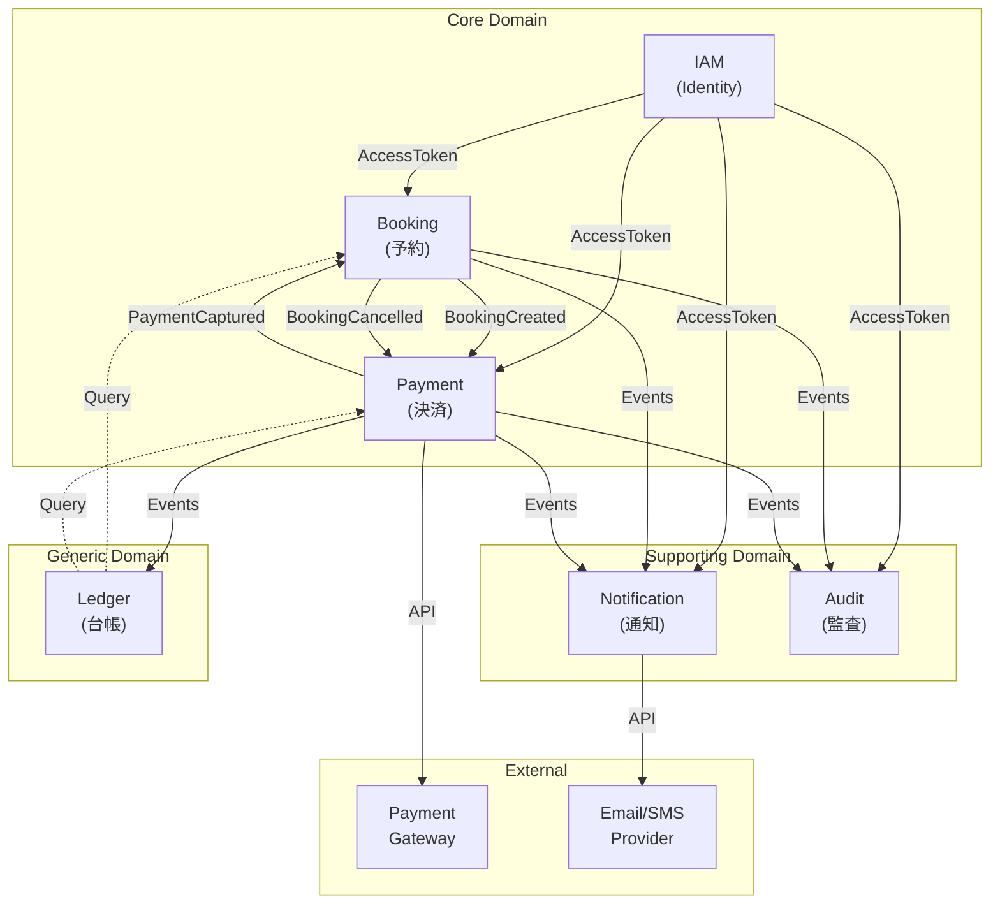

# 設計概要（SSOT）

本ドキュメントは、予約・決済基盤のシステム全体像、Bounded Context間の関係、およびデータフローを定義します。

---

## 1. システムアーキテクチャ

### 1.1 全体構成図

```
┌─────────────────────────────────────────────────────────────────────────────┐
│                              Client Layer                                    │
│  ┌─────────────┐  ┌─────────────┐  ┌─────────────┐  ┌─────────────┐        │
│  │   Web App   │  │ Mobile App  │  │  Admin UI   │  │ External    │        │
│  │  (Browser)  │  │ (iOS/And)   │  │             │  │ Systems     │        │
│  └──────┬──────┘  └──────┬──────┘  └──────┬──────┘  └──────┬──────┘        │
└─────────┼────────────────┼────────────────┼────────────────┼────────────────┘
          │                │                │                │
          ▼                ▼                ▼                ▼
┌─────────────────────────────────────────────────────────────────────────────┐
│                              API Gateway                                     │
│  ┌──────────────────────────────────────────────────────────────────────┐   │
│  │  • Rate Limiting  • Authentication  • Request Routing  • TLS Term.  │   │
│  └──────────────────────────────────────────────────────────────────────┘   │
└─────────────────────────────────────────────────────────────────────────────┘
          │
          ▼
┌─────────────────────────────────────────────────────────────────────────────┐
│                           Application Layer                                  │
│                                                                              │
│  ┌────────────────┐  ┌────────────────┐  ┌────────────────┐                 │
│  │  IAM Service   │  │Booking Service │  │Payment Service │                 │
│  │                │  │                │  │                │                 │
│  │ • Login        │  │ • Create       │  │ • Create       │                 │
│  │ • Refresh      │  │ • Update       │  │ • Authorize    │                 │
│  │ • Logout       │  │ • Cancel       │  │ • Capture      │                 │
│  │ • Token Valid. │  │ • Query        │  │ • Refund       │                 │
│  └───────┬────────┘  └───────┬────────┘  └───────┬────────┘                 │
│          │                   │                   │                          │
│          │    Domain Events  │                   │                          │
│          │    ─────────────▶ │ ◀─────────────    │                          │
│          │                   │                   │                          │
│  ┌───────┴───────────────────┴───────────────────┴────────┐                 │
│  │                    Message Broker                       │                 │
│  │              (Event-Driven Architecture)                │                 │
│  └───────┬───────────────────┬───────────────────┬────────┘                 │
│          │                   │                   │                          │
│  ┌───────▼────────┐  ┌───────▼────────┐  ┌───────▼────────┐                 │
│  │  Notification  │  │     Audit      │  │     Ledger     │                 │
│  │    Service     │  │    Service     │  │    Service     │                 │
│  │                │  │                │  │                │                 │
│  │ • Email        │  │ • Log Events   │  │ • Projections  │                 │
│  │ • Push         │  │ • Compliance   │  │ • Reporting    │                 │
│  │ • SMS          │  │ • Retention    │  │ • Analytics    │                 │
│  └────────────────┘  └────────────────┘  └────────────────┘                 │
│                                                                              │
└─────────────────────────────────────────────────────────────────────────────┘
          │
          ▼
┌─────────────────────────────────────────────────────────────────────────────┐
│                           Data Layer                                         │
│                                                                              │
│  ┌────────────────┐  ┌────────────────┐  ┌────────────────┐                 │
│  │  PostgreSQL    │  │     Redis      │  │  Elasticsearch │                 │
│  │  (Primary DB)  │  │    (Cache)     │  │    (Search)    │                 │
│  └────────────────┘  └────────────────┘  └────────────────┘                 │
│                                                                              │
└─────────────────────────────────────────────────────────────────────────────┘
          │
          ▼
┌─────────────────────────────────────────────────────────────────────────────┐
│                         External Services                                    │
│                                                                              │
│  ┌────────────────┐  ┌────────────────┐  ┌────────────────┐                 │
│  │Payment Gateway │  │  Email/SMS     │  │  Observability │                 │
│  │ (Stripe等)     │  │   Provider     │  │   Platform     │                 │
│  └────────────────┘  └────────────────┘  └────────────────┘                 │
│                                                                              │
└─────────────────────────────────────────────────────────────────────────────┘
```

### 1.2 技術スタック

| レイヤー | 技術 | 用途 |
|----------|------|------|
| **言語/FW** | Java 21 + Spring Boot 3.x | アプリケーション開発 |
| **API** | OpenAPI 3.0 | API契約定義 |
| **データベース** | PostgreSQL 15+ | 主データストア |
| **キャッシュ** | Redis 7+ | セッション、キャッシュ |
| **メッセージング** | Kafka / RabbitMQ | イベント駆動連携 |
| **検索** | Elasticsearch 8+ | ログ集約、検索 |
| **観測性** | OpenTelemetry, Prometheus, Grafana | メトリクス、トレース |
| **CI/CD** | GitHub Actions | ビルド、テスト、デプロイ |
| **コンテナ** | Docker, Kubernetes | コンテナ化、オーケストレーション |

### 1.3 Hexagonal Architecture（各サービス内部）

```
┌─────────────────────────────────────────────────────────────┐
│                        Service                               │
│  ┌───────────────────────────────────────────────────────┐  │
│  │                   Adapter Layer                        │  │
│  │  ┌─────────────┐              ┌─────────────┐         │  │
│  │  │  REST API   │              │  Repository │         │  │
│  │  │  Controller │              │   (JPA)     │         │  │
│  │  └──────┬──────┘              └──────┬──────┘         │  │
│  │         │  Inbound                   │  Outbound      │  │
│  └─────────┼────────────────────────────┼────────────────┘  │
│            │                            │                    │
│  ┌─────────▼────────────────────────────▼────────────────┐  │
│  │                  Application Layer                     │  │
│  │  ┌────────────────────────────────────────────────┐   │  │
│  │  │              Use Cases                          │   │  │
│  │  │   • CreateBookingUseCase                       │   │  │
│  │  │   • UpdateBookingUseCase                       │   │  │
│  │  │   • CancelBookingUseCase                       │   │  │
│  │  └────────────────────────────────────────────────┘   │  │
│  └───────────────────────────┬───────────────────────────┘  │
│                              │                               │
│  ┌───────────────────────────▼───────────────────────────┐  │
│  │                    Domain Layer                        │  │
│  │  ┌──────────────┐  ┌──────────────┐  ┌─────────────┐  │  │
│  │  │  Aggregates  │  │    Value     │  │   Domain    │  │  │
│  │  │   (Booking)  │  │   Objects    │  │   Events    │  │  │
│  │  └──────────────┘  └──────────────┘  └─────────────┘  │  │
│  └───────────────────────────────────────────────────────┘  │
│                                                              │
└─────────────────────────────────────────────────────────────┘
```

### 1.4 コード構成（パッケージ）

- Bounded Context をトップに置き、層はその配下に配置する。
- 横断関心（共通例外、共通Adapterなど）は `com.booking.shared` 配下に集約する。

```
com.booking.iam.domain.*
com.booking.iam.application.*
com.booking.iam.adapter.web.*
com.booking.iam.adapter.persistence.*

com.booking.booking.domain.*
com.booking.payment.domain.*

com.booking.shared.*
```

---

## 2. Bounded Context間関係図（Context Map）

### 2.1 Context Map概要



### 2.2 関係性詳細

| 上流 | 下流 | 関係タイプ | 説明 |
|------|------|-----------|------|
| IAM | Booking | Customer-Supplier | IAMがAccessTokenを提供、Bookingが検証 |
| IAM | Payment | Customer-Supplier | IAMがAccessTokenを提供、Paymentが検証 |
| Booking | Payment | Publisher-Subscriber | BookingCreatedでPaymentが処理開始 |
| Payment | Booking | Conformist | PaymentCapturedでBookingがCONFIRMED |
| Booking | Notification | Publisher-Subscriber | 予約イベントで通知送信 |
| Booking | Audit | Publisher-Subscriber | 予約操作を監査記録 |
| Payment | Notification | Publisher-Subscriber | 決済イベントで通知送信 |
| Payment | Audit | Publisher-Subscriber | 決済操作を監査記録 |
| Payment | Ledger | Publisher-Subscriber | 決済イベントで台帳更新 |
| Payment | Gateway | ACL | 外部決済ゲートウェイ連携 |

### 2.3 統合パターン

| パターン | 使用箇所 | 説明 |
|----------|----------|------|
| **Shared Kernel** | なし | 各BCは独立 |
| **Customer-Supplier** | IAM → 他BC | IAMが認証情報を提供 |
| **Publisher-Subscriber** | 大部分 | ドメインイベントによる非同期連携 |
| **Conformist** | Payment → Booking | PaymentのイベントにBookingが従う |
| **Anti-Corruption Layer** | Payment ↔ Gateway | 外部API変更から保護 |

---

## 3. データフロー図

### 3.1 予約作成フロー

```
┌──────┐    ┌───────────┐    ┌─────────┐    ┌─────────┐    ┌──────────┐
│Client│    │API Gateway│    │   IAM   │    │ Booking │    │  Payment │
└──┬───┘    └─────┬─────┘    └────┬────┘    └────┬────┘    └────┬─────┘
   │              │               │              │               │
   │ 1. Login     │               │              │               │
   │─────────────▶│               │              │               │
   │              │ 2. Validate   │              │               │
   │              │──────────────▶│              │               │
   │              │               │              │               │
   │              │ 3. Token      │              │               │
   │◀─────────────│◀──────────────│              │               │
   │              │               │              │               │
   │ 4. Create Booking            │              │               │
   │─────────────▶│               │              │               │
   │              │ 5. Verify Token              │               │
   │              │──────────────▶│              │               │
   │              │               │              │               │
   │              │ 6. Forward    │              │               │
   │              │──────────────────────────────▶│               │
   │              │               │              │               │
   │              │               │  7. Check Conflict           │
   │              │               │              │───┐            │
   │              │               │              │◀──┘            │
   │              │               │              │               │
   │              │               │  8. Save Booking             │
   │              │               │              │───┐            │
   │              │               │              │◀──┘            │
   │              │               │              │               │
   │              │               │  9. Publish BookingCreated   │
   │              │               │              │──────────────▶│
   │              │               │              │               │
   │              │               │              │  10. Create   │
   │              │               │              │     Payment   │
   │              │               │              │               │───┐
   │              │               │              │               │◀──┘
   │              │               │              │               │
   │ 11. Booking Response         │              │               │
   │◀─────────────│◀──────────────────────────────│               │
   │              │               │              │               │
```

### 3.2 支払い完了フロー

```
┌──────┐    ┌─────────┐    ┌─────────┐    ┌──────────┐    ┌────────┐
│Client│    │ Booking │    │ Payment │    │ Gateway  │    │  Audit │
└──┬───┘    └────┬────┘    └────┬────┘    └────┬─────┘    └───┬────┘
   │             │              │              │              │
   │ 1. Submit Payment          │              │              │
   │────────────────────────────▶│              │              │
   │             │              │              │              │
   │             │  2. Authorize│              │              │
   │             │              │─────────────▶│              │
   │             │              │              │              │
   │             │  3. Auth OK  │              │              │
   │             │              │◀─────────────│              │
   │             │              │              │              │
   │             │  4. Capture  │              │              │
   │             │              │─────────────▶│              │
   │             │              │              │              │
   │             │  5. Captured │              │              │
   │             │              │◀─────────────│              │
   │             │              │              │              │
   │             │  6. Publish PaymentCaptured │              │
   │             │◀─────────────│              │              │
   │             │              │──────────────────────────────▶│
   │             │              │              │              │
   │  7. Confirm │              │              │              │
   │    Booking  │───┐          │              │              │
   │             │◀──┘          │              │              │
   │             │              │              │              │
   │  8. Publish BookingConfirmed              │              │
   │             │──────────────────────────────────────────────▶│
   │             │              │              │              │
   │ 9. Payment Complete        │              │              │
   │◀────────────────────────────│              │              │
   │             │              │              │              │
```

### 3.3 キャンセル・返金フロー

```
┌──────┐    ┌─────────┐    ┌─────────┐    ┌──────────┐    ┌────────────┐
│Client│    │ Booking │    │ Payment │    │ Gateway  │    │Notification│
└──┬───┘    └────┬────┘    └────┬────┘    └────┬─────┘    └─────┬──────┘
   │             │              │              │                │
   │ 1. Cancel Booking          │              │                │
   │────────────▶│              │              │                │
   │             │              │              │                │
   │  2. Update  │              │              │                │
   │    Status   │───┐          │              │                │
   │             │◀──┘          │              │                │
   │             │              │              │                │
   │  3. Publish BookingCancelled              │                │
   │             │─────────────▶│              │                │
   │             │──────────────────────────────────────────────▶│
   │             │              │              │                │
   │             │  4. Check if CONFIRMED      │                │
   │             │              │───┐          │                │
   │             │              │◀──┘          │                │
   │             │              │              │                │
   │             │  5. Refund   │              │                │
   │             │              │─────────────▶│                │
   │             │              │              │                │
   │             │  6. Refunded │              │                │
   │             │              │◀─────────────│                │
   │             │              │              │                │
   │             │  7. Publish PaymentRefunded │                │
   │             │              │──────────────────────────────▶│
   │             │              │              │                │
   │             │              │              │   8. Send      │
   │             │              │              │   Notification │
   │             │              │              │                │───┐
   │             │              │              │                │◀──┘
   │             │              │              │                │
   │ 9. Cancel Complete         │              │                │
   │◀────────────│              │              │                │
   │             │              │              │                │
```

---

## 4. デプロイメントアーキテクチャ

### 4.1 Kubernetes構成

```
┌─────────────────────────────────────────────────────────────────────────────┐
│                           Kubernetes Cluster                                 │
│                                                                              │
│  ┌─────────────────────────────────────────────────────────────────────────┐│
│  │                          Ingress Controller                              ││
│  │                    (NGINX / AWS ALB Ingress)                            ││
│  └─────────────────────────────────────────────────────────────────────────┘│
│                                    │                                         │
│  ┌─────────────────────────────────┼─────────────────────────────────────┐  │
│  │                     booking-payment namespace                          │  │
│  │                                 │                                      │  │
│  │  ┌──────────────┐  ┌──────────────┐  ┌──────────────┐                 │  │
│  │  │ iam-service  │  │booking-svc   │  │payment-svc   │                 │  │
│  │  │              │  │              │  │              │                 │  │
│  │  │ Deployment   │  │ Deployment   │  │ Deployment   │                 │  │
│  │  │ replicas: 2  │  │ replicas: 3  │  │ replicas: 2  │                 │  │
│  │  │              │  │              │  │              │                 │  │
│  │  │ Service      │  │ Service      │  │ Service      │                 │  │
│  │  │ HPA          │  │ HPA          │  │ HPA          │                 │  │
│  │  └──────────────┘  └──────────────┘  └──────────────┘                 │  │
│  │                                                                        │  │
│  │  ┌──────────────┐  ┌──────────────┐  ┌──────────────┐                 │  │
│  │  │notification  │  │ audit-svc    │  │ ledger-svc   │                 │  │
│  │  │   -svc       │  │              │  │              │                 │  │
│  │  │ Deployment   │  │ Deployment   │  │ Deployment   │                 │  │
│  │  │ replicas: 2  │  │ replicas: 2  │  │ replicas: 1  │                 │  │
│  │  └──────────────┘  └──────────────┘  └──────────────┘                 │  │
│  │                                                                        │  │
│  │  ┌────────────────────────────────────────────────────────────────┐   │  │
│  │  │                    ConfigMaps & Secrets                         │   │  │
│  │  └────────────────────────────────────────────────────────────────┘   │  │
│  │                                                                        │  │
│  └────────────────────────────────────────────────────────────────────────┘  │
│                                                                              │
│  ┌─────────────────────────────────────────────────────────────────────────┐│
│  │                         observability namespace                          ││
│  │  ┌──────────────┐  ┌──────────────┐  ┌──────────────┐                   ││
│  │  │  Prometheus  │  │   Grafana    │  │    Jaeger    │                   ││
│  │  └──────────────┘  └──────────────┘  └──────────────┘                   ││
│  └─────────────────────────────────────────────────────────────────────────┘│
│                                                                              │
└─────────────────────────────────────────────────────────────────────────────┘
                                    │
                                    ▼
┌─────────────────────────────────────────────────────────────────────────────┐
│                          Managed Services                                    │
│  ┌──────────────┐  ┌──────────────┐  ┌──────────────┐  ┌──────────────┐    │
│  │  RDS         │  │ ElastiCache  │  │    MSK       │  │    S3        │    │
│  │ (PostgreSQL) │  │   (Redis)    │  │   (Kafka)    │  │  (Storage)   │    │
│  └──────────────┘  └──────────────┘  └──────────────┘  └──────────────┘    │
└─────────────────────────────────────────────────────────────────────────────┘
```

### 4.2 環境構成

| 環境 | 用途 | 構成 |
|------|------|------|
| **Development** | 開発者ローカル | Docker Compose |
| **CI** | 自動テスト | GitHub Actions + Testcontainers |
| **Staging** | 検証環境 | Kubernetes (縮小構成) |
| **Production** | 本番環境 | Kubernetes (冗長構成) |

---

## 5. セキュリティアーキテクチャ

### 5.1 認証・認可フロー

```
┌────────┐     ┌───────────┐     ┌─────────┐     ┌─────────────┐
│ Client │     │API Gateway│     │   IAM   │     │  Services   │
└───┬────┘     └─────┬─────┘     └────┬────┘     └──────┬──────┘
    │                │                │                 │
    │ 1. Login       │                │                 │
    │───────────────▶│                │                 │
    │                │ 2. Forward     │                 │
    │                │───────────────▶│                 │
    │                │                │                 │
    │                │ 3. AccessToken │                 │
    │◀───────────────│◀───────────────│                 │
    │                │                │                 │
    │ 4. API Request (with Token)     │                 │
    │───────────────▶│                │                 │
    │                │                │                 │
    │                │ 5. Validate Token (JWT verify)   │
    │                │────────────────────────────────▶│
    │                │                │                 │
    │                │ 6. Extract userId, check authz  │
    │                │                │                 │───┐
    │                │                │                 │◀──┘
    │                │                │                 │
    │ 7. Response    │                │                 │
    │◀───────────────│◀────────────────────────────────│
    │                │                │                 │
```

### 5.2 セキュリティレイヤー

| レイヤー | 対策 | 詳細 |
|----------|------|------|
| **ネットワーク** | TLS 1.3, WAF | 通信暗号化、攻撃防御 |
| **API Gateway** | Rate Limiting, CORS | DDoS対策、クロスオリジン制御 |
| **認証** | JWT (RS256) | ステートレス認証 |
| **認可** | Owner-based | リソース所有者のみアクセス可 |
| **データ** | Encryption at rest | PostgreSQL暗号化 |
| **監査** | Audit Log | 全操作記録 |

---

## 6. 関連ドキュメント

| ドキュメント | 内容 |
|--------------|------|
| `docs/design/contexts/*.md` | 各Bounded Contextの詳細設計 |
| `docs/design/usecases/*.md` | ユースケース設計 |
| `docs/api/openapi/*.yaml` | API契約 |
| `docs/design/observability.md` | 観測性設計 |
| `docs/security/pii-policy.md` | PII保護ポリシー |
| `docs/security/secrets.md` | シークレット管理 |

---

## 7. Evidence（根拠）

| 項目 | 根拠 | 備考 |
|------|------|------|
| Hexagonal Architecture | Alistair Cockburn, "Hexagonal Architecture" | ポートとアダプター |
| Context Map | Eric Evans, "Domain-Driven Design" | 戦略的DDD |
| Event-Driven | Martin Fowler, "Event-Driven Architecture" | 疎結合統合 |
| Kubernetes | CNCF, Cloud Native Best Practices | コンテナオーケストレーション |

---

## 8. 未決事項

| 項目 | 内容 | 優先度 |
|------|------|--------|
| サービスメッシュ | Istio/Linkerd導入要否 | 中 |
| マルチリージョン | DR構成の詳細設計 | 中 |
| キャッシュ戦略 | Redis利用パターンの詳細化 | 中 |
| API Versioning | バージョニング戦略の詳細化 | 高 |
