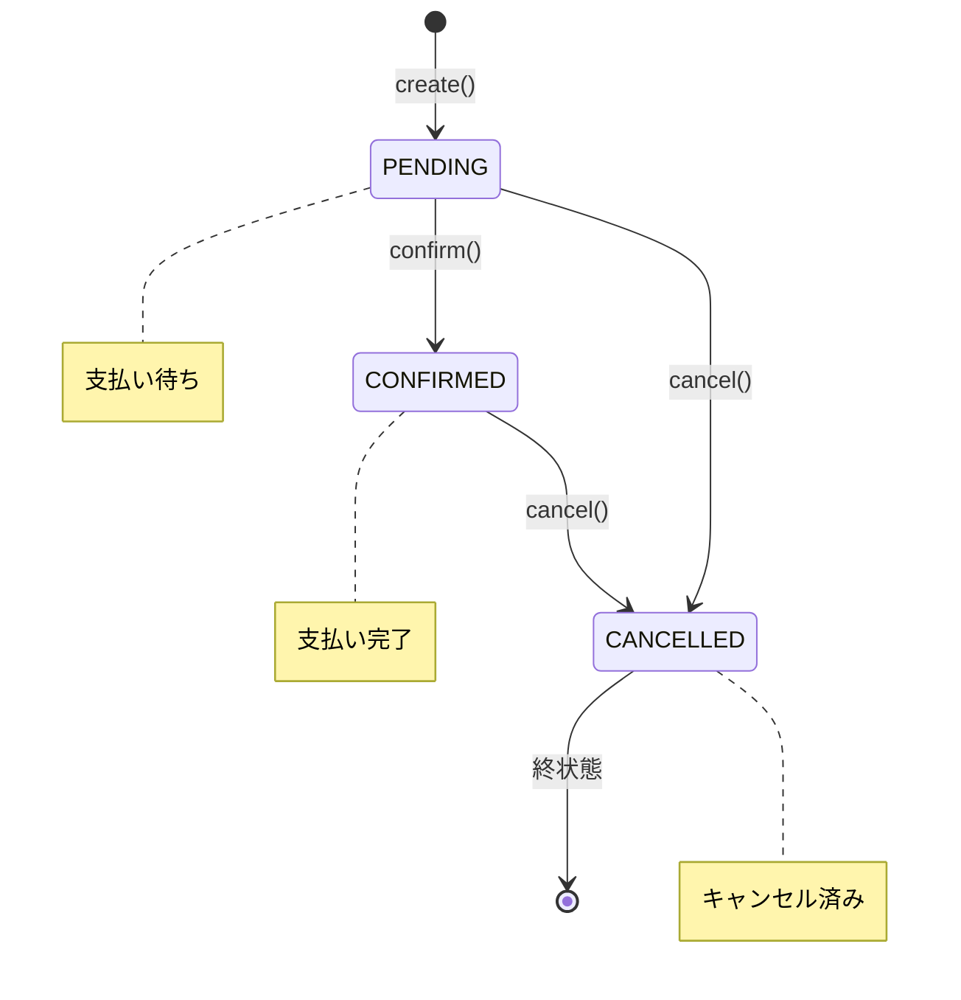

# 1. 目的 / 背景

## 目的
ユーザーが予約をキャンセルできるようにする。

## 背景
- 予約後にスケジュール変更や不要になるケースは一般的
- キャンセルにより、リソースの時間帯が解放され、他ユーザーが予約可能になる
- CONFIRMED状態（支払い済み）からのキャンセルは返金処理をトリガーする
- キャンセル操作は監査ログに記録される

## ユースケース概要
1. ユーザーが予約IDを指定してキャンセルを要求
2. システムが予約の所有者を検証
3. 現在の状態がPENDINGまたはCONFIRMEDであることを確認
4. 予約をCANCELLED状態に遷移
5. BookingCancelledイベントを発行
6. CONFIRMEDからのキャンセルの場合、Paymentコンテキストが返金処理を開始

---

# 2. ユビキタス言語

- SSOT：`docs/domain/glossary.md`
- 主要用語：
  - **Booking**：リソースの特定時間帯の利用権を表す集約
  - **BookingStatus**：予約のライフサイクル状態
    - `PENDING`：支払い待ち状態（キャンセル可能、返金不要）
    - `CONFIRMED`：支払い完了・予約確定状態（キャンセル可能、返金必要）
    - `CANCELLED`：キャンセル済み状態（終状態、変更不可）
  - **TimeRange**：開始時刻（startAt）と終了時刻（endAt）のペア
    - ドメインモデルでは値オブジェクト `timeRange: TimeRange` として表現
    - API/イベントでは `startAt`、`endAt` として個別フィールドで表現（表現規約は glossary.md 参照）

---

# 3. 依存関係（Context Map）

```
┌─────────────────┐
│       IAM       │
│   (Identity)    │
└────────┬────────┘
         │ AccessToken（認証）
         ▼
┌─────────────────────────────────────────┐
│              Booking                     │
│                                          │
│  ・予約キャンセル                         │
│  ・状態遷移検証                          │
│  ・所有者検証                            │
└────────┬─────────────────┬──────────────┘
         │                 │
         │ BookingCancelled│
         ▼                 ▼
┌─────────────┐     ┌─────────────┐     ┌─────────────┐
│   Payment   │     │    Audit    │     │Notification │
│             │     │             │     │             │
│ 返金処理    │     │ 監査記録    │     │ キャンセル  │
│(CONFIRMED時)│     │             │     │ 通知        │
└─────────────┘     └─────────────┘     └─────────────┘
```

## 関係性

| 関係 | 種別 | 説明 |
|------|------|------|
| IAM → Booking | Customer-Supplier | IAMがAccessTokenを提供、Bookingが検証して使用 |
| Booking → Payment | Publisher-Subscriber | BookingCancelledイベント（previousStatus=CONFIRMED）でPaymentが返金処理を開始 |
| Booking → Audit | Publisher-Subscriber | BookingCancelledイベントをAuditが購読して記録 |
| Booking → Notification | Publisher-Subscriber | BookingCancelledイベントをNotificationが購読してキャンセル通知 |

## 統合パターン

- **Payment との統合**：
  - BookingCancelledイベントの`previousStatus`を確認
  - `previousStatus == "CONFIRMED"` の場合のみ返金処理を開始
  - `previousStatus == "PENDING"` の場合は返金不要（支払い未完了）

---

# 4. 入出力（Command/Query/Event）

## Command: CancelBookingCommand

**注意**：Commandはユースケースドキュメントで定義。コンテキスト設計（booking.md）では集約とドメインイベントを定義。

```
CancelBookingCommand {
  bookingId: UUID (required, from path)
  userId: UUID (from AccessToken)
  cancelReason: String? (optional, max: 500)
}
```

## Response: Booking
```
Booking {
  id: UUID
  userId: UUID
  resourceId: UUID
  startAt: DateTime
  endAt: DateTime
  status: "CANCELLED"
  note: String?
  version: Integer
  cancelledAt: DateTime
  cancelReason: String?
  createdAt: DateTime
  updatedAt: DateTime
}
```

## Domain Event: BookingCancelled

**注意**：イベント構造は `docs/design/contexts/booking.md` のセクション6.4を参照（SSOT）

```
BookingCancelled {
  eventId: UUID
  aggregateId: BookingId
  occurredAt: DateTime
  payload: {
    bookingId: UUID
    userId: UUID
    resourceId: UUID
    previousStatus: BookingStatus ("PENDING" | "CONFIRMED")
    cancelReason: String?
    cancelledAt: DateTime
  }
}
```

**購読者：**
- Payment（返金処理、previousStatus=CONFIRMEDの場合のみ）
- Audit（監査記録）
- Notification（キャンセル通知）

---

# 5. ドメインモデル（集約/不変条件）

## 集約：Booking（キャンセル時の振る舞い）

```
Booking (Aggregate Root) {
  // キャンセルメソッド
  cancel(reason: String?): Result<Booking, Error>
}
```

## 不変条件

1. **キャンセル可能な状態**：status が PENDING または CONFIRMED であること
2. **CANCELLEDは終状態**：一度CANCELLEDになった予約は変更不可
3. **所有者のみ操作可能**：booking.userId == token.userId

## 状態遷移



## キャンセル処理フロー

```
1. 予約を取得
2. 所有者検証（booking.userId == token.userId）
   ├─ 不一致 → 403 Forbidden
   └─ 一致
       └─ 状態検証（status）
           ├─ CANCELLED → 422 Unprocessable Entity (ALREADY_CANCELLED)
           └─ PENDING/CONFIRMED
               ├─ previousStatus を記録
               ├─ status = CANCELLED
               ├─ cancelledAt = now
               ├─ cancelReason = request.cancelReason
               └─ version++
3. BookingCancelledイベントを発行
```

---

# 6. API（OpenAPI参照）

- SSOT：`docs/api/openapi/booking.yaml`
- エンドポイント：
  - `DELETE /bookings/{id}` - 予約キャンセル

---

# 7. 永続化

## キャンセルクエリ

```sql
UPDATE bookings
SET status = 'CANCELLED',
    cancelled_at = :now,
    cancel_reason = :cancelReason,
    version = version + 1,
    updated_at = :now
WHERE id = :bookingId
  AND user_id = :userId
  AND status != 'CANCELLED';
```

**注意**：
- `WHERE status != 'CANCELLED'` により既にキャンセル済みの場合は更新されない
- 更新行数が0の場合は状態検証が必要

## キャンセル前の状態取得クエリ

```sql
SELECT id, status FROM bookings
WHERE id = :bookingId
  AND user_id = :userId;
```

**注意**：イベントに`previousStatus`を含めるため、キャンセル前の状態を取得する必要がある

---

# 8. 失敗モードとリカバリ（timeout/retry/idempotency）

## 失敗モード一覧

| 失敗モード | HTTPステータス | 原因 | リカバリ |
|------------|----------------|------|----------|
| UNAUTHORIZED | 401 | AccessToken無効/期限切れ | トークンをリフレッシュして再試行 |
| FORBIDDEN | 403 | 他ユーザーの予約へのアクセス | 権限を確認 |
| NOT_FOUND | 404 | 予約が見つからない | IDを確認 |
| ALREADY_CANCELLED | 422 | 既にキャンセル済み | リカバリ不要（冪等性） |
| INTERNAL_ERROR | 500 | サーバー内部エラー | 指数バックオフでリトライ |

## Timeout設計

- **API全体のタイムアウト**：5秒
- **DB接続タイムアウト**：1秒

## Retry戦略

- **クライアント側**：
  - 422 ALREADY_CANCELLED：リトライ不要、成功と同等に扱う
  - 500 INTERNAL_ERROR：指数バックオフでリトライ（最大3回）
- **サーバー側**：DB接続失敗時は最大2回リトライ（指数バックオフ）

## Idempotency

- キャンセル操作は実質的に冪等
- 既にCANCELLEDの予約に対するキャンセルは422を返すが、クライアントは成功と同等に扱える
- 同一予約に対する複数回のキャンセル試行は安全

---

# 9. 観測性（logs/metrics/traces）

## ログ

| イベント | ログレベル | 必須フィールド | 備考 |
|----------|------------|----------------|------|
| BookingCancelAttempted | INFO | traceId, bookingId, userId | - |
| BookingCancelled | INFO | traceId, bookingId, userId, previousStatus | 成功 |
| BookingCancelForbidden | WARN | traceId, bookingId, requestUserId, ownerUserId | 権限エラー |
| BookingAlreadyCancelled | WARN | traceId, bookingId | 既にキャンセル済み |

## メトリクス

| メトリクス名 | 型 | ラベル | 説明 |
|--------------|-----|--------|------|
| `booking_cancel_total` | Counter | status=[success\|forbidden\|already_cancelled\|error], previous_status=[pending\|confirmed] | 予約キャンセル試行数 |
| `booking_cancel_duration_seconds` | Histogram | status | キャンセル処理時間 |
| `booking_refund_triggered_total` | Counter | - | 返金トリガー発生数（CONFIRMED→CANCELLED） |

## トレース

- **SpanName**：`Booking.cancel`
- **必須属性**：
  - `booking.id`
  - `booking.resource_id`
  - `booking.previous_status`
  - `booking.status`：success | forbidden | already_cancelled | error
- **子Span**：
  - `Booking.validateOwner` - 所有者検証
  - `Booking.validateState` - 状態検証
  - `Booking.persist` - 永続化
  - `Booking.publishEvent` - イベント発行

---

# 10. セキュリティ（authn/authz/audit/PII）

## 認証（AuthN）

- 有効なAccessToken（JWT）が必要
- トークンからuserIdを抽出

## 認可（AuthZ）

| 操作 | 認可ルール |
|------|----------|
| 予約キャンセル | 予約の所有者（booking.userId == token.userId）のみ |

## 監査

- 予約キャンセルを監査ログに記録
- 監査ログには以下を含める：
  - タイムスタンプ
  - 操作種別（CANCEL）
  - ユーザーID
  - 予約ID
  - 以前の状態（previousStatus）
  - キャンセル理由
  - 結果（success/failure）

## PII保護

- 予約データにPIIは含まない（userIdはUUID）
- ログにユーザー名やメールアドレスを出力しない
- cancelReasonにPIIが含まれないよう注意（ユーザー入力の検証を検討）

---

# 11. テスト戦略（Unit/Integration/Contract/E2E）

## Unit Tests

| テスト対象 | テストケース |
|------------|-------------|
| Booking.cancel | PENDING状態からの正常キャンセル |
| Booking.cancel | CONFIRMED状態からの正常キャンセル |
| Booking.cancel | CANCELLED状態からのキャンセル拒否 |
| Booking.cancel | キャンセル理由の記録 |

## Integration Tests

| テスト対象 | テストケース |
|------------|-------------|
| BookingRepository | キャンセル更新、previousStatus取得 |
| CancelBookingUseCase | 正常キャンセル、所有者検証、状態検証 |

## Contract Tests

- OpenAPI `booking.yaml` に対する契約テスト
- DELETE /bookings/{id} のレスポンス形式検証
- 422 Unprocessable Entityのtype属性によるALREADY_CANCELLED判別

## E2E Tests

| シナリオ | 検証内容 |
|----------|----------|
| PENDINGキャンセル | POST → DELETE → status=CANCELLEDを確認 |
| CONFIRMEDキャンセル | POST → 支払い → DELETE → 返金処理トリガー確認 |
| 二重キャンセル | DELETE → DELETE → 422 ALREADY_CANCELLED |
| 権限検証 | 他ユーザーの予約キャンセル → 403 |
| キャンセル後のアクセス | DELETE → GET → status=CANCELLEDを確認 |

## 境界値テスト

- キャンセル理由の最大長（500文字）
- キャンセル理由がnullの場合
- 同時キャンセル要求（競合状態）

---

# 12. ADRリンク

- ADR-006: 予約ステータス遷移の設計（作成予定）
- ADR-011: キャンセルポリシーの設計（作成予定）

---

# 13. Evidence（根拠）

| 項目 | 根拠 | 備考 |
|------|------|------|
| CANCELLEDは終状態 | 一般的な予約システムのパターン | 復元は新規作成で対応 |
| previousStatusの記録 | 返金処理の判断に必要 | イベント駆動設計のベストプラクティス |
| 422 for ALREADY_CANCELLED | 状態遷移の失敗は422が適切 | RFC 4918 |
| キャンセルの実質的冪等性 | クライアントの再試行を安全にするため | 運用上重要 |

---

# 14. 未決事項

| 項目 | 内容 | 優先度 |
|------|------|--------|
| キャンセルポリシー | キャンセル期限（開始24時間前まで等） | 高（Slice Bで対応） |
| キャンセル料 | 直前キャンセルの場合のキャンセル料 | 高（Slice Bで対応） |
| 管理者キャンセル | 運営者による強制キャンセル機能 | 中 |
| キャンセル理由の選択肢 | 定型理由の提供（UI/UX） | 低 |
| 自動キャンセル | 支払いタイムアウト時の自動キャンセル | 高（Slice Bで対応） |
