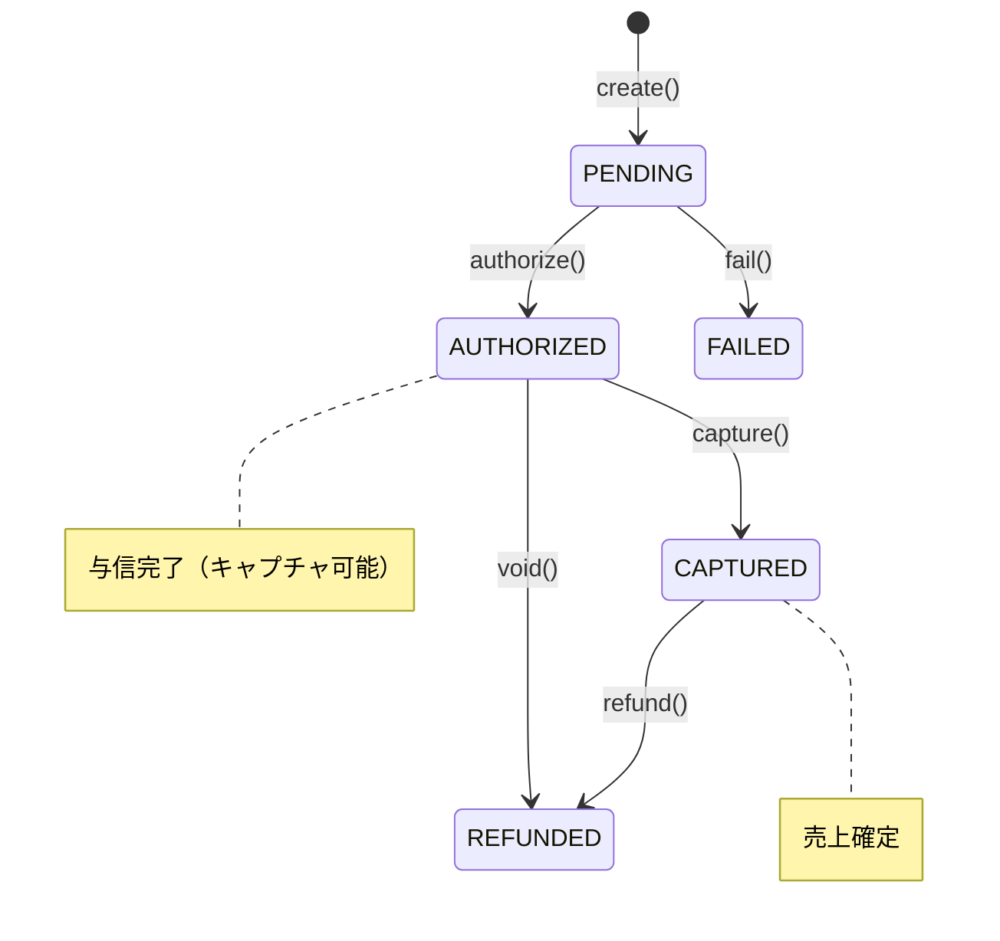

# 1. 目的 / 背景

## 目的
与信済み（AUTHORIZED）の支払いを確定（キャプチャ）し、実際に顧客から資金を回収する。

## 背景
- 2フェーズ決済（Authorize/Capture）パターンを採用
- 予約確定（CONFIRMED）のタイミングでキャプチャを実行
- 与信から一定期間内にキャプチャしないと与信が失効する（通常7日〜30日）
- キャプチャは冪等であるべき（リトライ時に二重課金を防ぐ）

## ユースケース概要
1. PaymentCapturedイベント（予約確定トリガー）またはAPIリクエストを受信
2. 支払いがAUTHORIZED状態であることを確認
3. 外部決済ゲートウェイにキャプチャリクエスト
4. 成功時：支払いをCAPTURED状態に更新
5. PaymentCapturedイベントを発行 → BookingがCONFIRMEDに遷移

---

# 2. ユビキタス言語

- SSOT：`docs/domain/glossary.md`
- 主要用語：
  - **Payment**：予約に紐づく決済を表す集約
  - **PaymentStatus**：PENDING | AUTHORIZED | CAPTURED | REFUNDED | FAILED
  - **Capture**：与信済みの金額を実際に回収する操作
  - **CapturedAmount**：実際にキャプチャされた金額（部分キャプチャ対応時に使用）

---

# 3. 依存関係（Context Map）

```
┌─────────────────┐
│     Booking     │
│                 │
│ BookingConfirmed│──────────────────┐
│   トリガー       │                  │
└─────────────────┘                  │
                                     ▼
┌─────────────────────────────────────────┐
│              Payment                     │
│                                          │
│  ・キャプチャ処理                         │
│  ・状態遷移（AUTHORIZED → CAPTURED）     │
│  ・外部ゲートウェイ連携                   │
└────────┬─────────────────┬──────────────┘
         │                 │
         │ PaymentCaptured │ PaymentCaptureFailed
         ▼                 ▼
┌─────────────────┐     ┌─────────────┐     ┌─────────────┐
│ Payment Gateway │     │    Audit    │     │   Booking   │
│   (External)    │     │             │     │             │
│   ACL経由       │     │ 監査記録    │     │ CONFIRMED   │
└─────────────────┘     └─────────────┘     └─────────────┘
```

## 関係性

| 関係 | 種別 | 説明 |
|------|------|------|
| Booking → Payment | Saga/Choreography | 予約作成後、Paymentが支払い処理を実行、キャプチャ後にBookingがCONFIRMED |
| Payment → Gateway | Customer-Supplier (ACL) | 外部ゲートウェイとAnti-Corruption Layer経由で連携 |
| Payment → Audit | Publisher-Subscriber | PaymentCapturedイベントをAuditが購読して記録 |
| Payment → Booking | Publisher-Subscriber | PaymentCapturedでBookingがCONFIRMEDに遷移 |

---

# 4. 入出力（Command/Query/Event）

## Command: CapturePaymentCommand
```
CapturePaymentCommand {
  paymentId: UUID (required, from path)
  userId: UUID (from AccessToken)
  amount: Integer? (optional, for partial capture; omit for full capture)
}
```

## Response: Payment
```
Payment {
  id: UUID
  bookingId: UUID
  userId: UUID
  amount: Integer
  capturedAmount: Integer
  refundedAmount: Integer?
  currency: String
  status: "CAPTURED"
  description: String?
  gatewayTransactionId: String
  idempotencyKey: UUID
  capturedAt: DateTime
  createdAt: DateTime
  updatedAt: DateTime
}
```

## Domain Event: PaymentCaptured
```
PaymentCaptured {
  eventId: UUID
  aggregateId: PaymentId
  occurredAt: DateTime
  payload: {
    paymentId: UUID
    bookingId: UUID
    userId: UUID
    capturedAmount: Integer
    currency: String
    gatewayTransactionId: String
  }
}
```

**購読者：** Booking（CONFIRMEDへ遷移）、Audit（監査記録）、Notification（支払い完了通知）

## Domain Event: PaymentCaptureFailed
```
PaymentCaptureFailed {
  eventId: UUID
  aggregateId: PaymentId
  occurredAt: DateTime
  payload: {
    paymentId: UUID
    bookingId: UUID
    userId: UUID
    failureReason: String
    failedAt: DateTime
  }
}
```

**購読者：** Audit（監査記録）、Notification（決済失敗通知）

---

# 5. ドメインモデル（集約/不変条件）

## 集約：Payment（キャプチャ時の振る舞い）

```
Payment (Aggregate Root) {
  // キャプチャメソッド
  capture(amount: Integer?): Result<Payment, Error>
}
```

## 不変条件

1. **キャプチャ可能な状態**：status == AUTHORIZED
2. **キャプチャ額は与信額以下**：capturedAmount <= amount
3. **キャプチャは一度のみ**：CAPTURED状態からの再キャプチャは不可
4. **与信有効期限内**：ゲートウェイの与信有効期限（通常7〜30日）内であること

## 状態遷移



## キャプチャ処理フロー

```
1. 支払いを取得
2. 所有者検証（payment.userId == token.userId）
   ├─ 不一致 → 403 Forbidden
   └─ 一致
       └─ 状態検証（status）
           ├─ CAPTURED → 200 OK (冪等：既存結果を返却)
           ├─ != AUTHORIZED → 422 Unprocessable Entity
           └─ AUTHORIZED
               ├─ キャプチャ額検証（amount <= authorized amount）
               ├─ 外部ゲートウェイにキャプチャリクエスト
               │   ├─ 成功 → status = CAPTURED, capturedAmount = amount
               │   └─ 失敗 → 適切なエラーレスポンス
               └─ PaymentCapturedイベントを発行
```

---

# 6. API（OpenAPI参照）

- SSOT：`docs/api/openapi/payment.yaml`
- エンドポイント：
  - `POST /payments/{id}/capture` - キャプチャ

---

# 7. 永続化

## キャプチャ更新クエリ

```sql
UPDATE payments
SET status = 'CAPTURED',
    captured_amount = :capturedAmount,
    captured_at = :now,
    updated_at = :now
WHERE id = :paymentId
  AND status = 'AUTHORIZED';
```

**注意**：
- `WHERE status = 'AUTHORIZED'` により既にキャプチャ済みの場合は更新されない
- 更新行数が0の場合は状態検証が必要

---

# 8. 失敗モードとリカバリ（timeout/retry/idempotency）

## 失敗モード一覧

| 失敗モード | HTTPステータス | 原因 | リカバリ |
|------------|----------------|------|----------|
| UNAUTHORIZED | 401 | AccessToken無効/期限切れ | トークンをリフレッシュして再試行 |
| FORBIDDEN | 403 | 支払いの所有者でない | 権限を確認 |
| NOT_FOUND | 404 | 支払いが見つからない | paymentIdを確認 |
| INVALID_STATE | 422 | AUTHORIZED以外の状態 | 現在の状態を確認 |
| AUTHORIZATION_EXPIRED | 422 | 与信有効期限切れ | 新規の支払い作成が必要 |
| GATEWAY_ERROR | 502 | 外部決済ゲートウェイエラー | 指数バックオフでリトライ |
| GATEWAY_TIMEOUT | 504 | 外部決済ゲートウェイタイムアウト | 状態確認後にリトライ |

## Timeout設計

- **API全体のタイムアウト**：30秒
- **外部ゲートウェイ呼び出しのタイムアウト**：15秒
- **DB接続タイムアウト**：1秒

## Retry戦略

### クライアント側
- 502/504の場合：最大3回リトライ（指数バックオフ）
- 既にCAPTURED状態の場合は200で成功レスポンスを返却（冪等）

### サーバー側
- 外部ゲートウェイ呼び出し失敗：最大2回リトライ（指数バックオフ）
- タイムアウト時：ゲートウェイに状態確認後、状態を更新

## Idempotency（冪等性）

- キャプチャ操作は冪等
- 既にCAPTURED状態の支払いに対するキャプチャは200で既存結果を返却
- paymentIdが冪等キーとして機能

---

# 9. 観測性（logs/metrics/traces）

## ログ

| イベント | ログレベル | 必須フィールド | 備考 |
|----------|------------|----------------|------|
| PaymentCaptureAttempted | INFO | traceId, paymentId, userId, amount | - |
| PaymentCaptured | INFO | traceId, paymentId, capturedAmount, gatewayTransactionId | - |
| PaymentCaptureGatewayRequest | INFO | traceId, paymentId, gatewayName | - |
| PaymentCaptureGatewayResponse | INFO | traceId, paymentId, status | - |
| PaymentCaptureFailed | ERROR | traceId, paymentId, errorCode, errorMessage | - |
| PaymentCaptureAlreadyDone | INFO | traceId, paymentId | 冪等リクエスト検出 |

## メトリクス

| メトリクス名 | 型 | ラベル | 説明 |
|--------------|-----|--------|------|
| `payment_capture_total` | Counter | status=[success\|failed\|already_captured] | キャプチャ試行数 |
| `payment_capture_duration_seconds` | Histogram | status | キャプチャ処理時間 |
| `payment_capture_amount_total` | Counter | currency | キャプチャ金額合計 |
| `payment_gateway_capture_total` | Counter | gateway, status | ゲートウェイキャプチャ数 |
| `payment_gateway_capture_duration_seconds` | Histogram | gateway | ゲートウェイ応答時間 |

## トレース

- **SpanName**：`Payment.capture`
- **必須属性**：
  - `payment.id`
  - `payment.booking_id`
  - `payment.captured_amount`
  - `payment.currency`
  - `payment.status`
- **子Span**：
  - `Payment.validateState` - 状態検証
  - `Payment.callGateway` - 外部ゲートウェイ呼び出し
  - `Payment.persist` - 永続化
  - `Payment.publishEvent` - イベント発行

---

# 10. セキュリティ（authn/authz/audit/PII）

## 認証（AuthN）

- 有効なAccessToken（JWT）が必要
- トークンからuserIdを抽出

## 認可（AuthZ）

| 操作 | 認可ルール |
|------|----------|
| キャプチャ | 支払いの所有者（payment.userId == token.userId） |

## 監査

- キャプチャ操作を監査ログに記録
- 監査ログには以下を含める：
  - タイムスタンプ
  - 操作種別（CAPTURE）
  - ユーザーID
  - 支払いID
  - キャプチャ金額
  - 結果（success/failure）

## PII/PCI DSS保護

- カード情報は本システムで保持しない
- ゲートウェイのトークン化された情報のみ使用
- ログにセンシティブ情報を出力しない

---

# 11. テスト戦略（Unit/Integration/Contract/E2E）

## Unit Tests

| テスト対象 | テストケース |
|------------|-------------|
| Payment.capture | AUTHORIZED状態からの正常キャプチャ |
| Payment.capture | CAPTURED状態からのキャプチャ（冪等、成功を返す） |
| Payment.capture | PENDING状態からのキャプチャ拒否 |
| Payment.capture | キャプチャ額が与信額を超える場合の拒否 |

## Integration Tests

| テスト対象 | テストケース |
|------------|-------------|
| PaymentRepository | キャプチャ更新、状態検証 |
| PaymentGatewayAdapter | 外部ゲートウェイとのキャプチャ連携（スタブ使用） |
| CapturePaymentUseCase | 正常キャプチャ、冪等性、ゲートウェイエラー |

## Contract Tests

- OpenAPI `payment.yaml` に対する契約テスト
- POST /payments/{id}/capture のレスポンス形式検証
- 冪等リクエストのレスポンス検証（200 vs 422）

## E2E Tests

| シナリオ | 検証内容 |
|----------|----------|
| 正常キャプチャフロー | 支払い作成 → 与信 → キャプチャ → CAPTURED確認 |
| 冪等キャプチャ | キャプチャ → 同一支払いで再キャプチャ → 200 |
| 権限検証 | 他ユーザーの支払いキャプチャ → 403 |
| 予約確定連携 | キャプチャ → BookingがCONFIRMEDに遷移確認 |

## 境界値テスト

- キャプチャ額の境界（与信額と同額、超過）
- 与信有効期限の境界
- 部分キャプチャの境界（有効/無効）

---

# 12. ADRリンク

- ADR-009: 支払いステータス遷移の設計（作成予定）
- ADR-012: キャプチャの冪等性設計（作成予定）

---

# 13. Evidence（根拠）

| 項目 | 根拠 | 備考 |
|------|------|------|
| 2フェーズ決済 | Stripe, PayPal等の標準パターン | 予約確定前の与信保持 |
| キャプチャの冪等性 | 決済システムのベストプラクティス | リトライ時の二重課金防止 |
| 与信有効期限 | 決済ゲートウェイの仕様 | 通常7〜30日（ゲートウェイ依存） |
| CAPTURED状態での再キャプチャ成功 | Stripe APIの仕様を参考 | 冪等性のための設計 |

---

# 14. 未決事項

| 項目 | 内容 | 優先度 |
|------|------|--------|
| 部分キャプチャ | 与信額の一部のみキャプチャする機能の詳細設計 | 中 |
| 自動キャプチャ | 予約確定時の自動キャプチャトリガー設計 | 高 |
| キャプチャ期限 | 与信有効期限切れ前の通知・自動処理 | 中 |
| オーバーキャプチャ | 与信額を超えるキャプチャの可否 | 低 |
