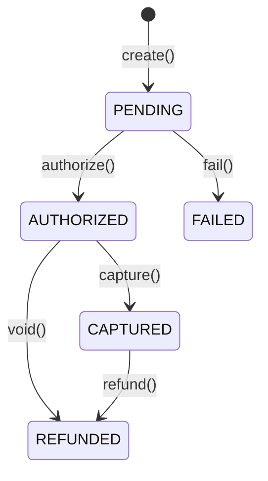

# 1. 目的 / 背景

## 目的
予約に対する支払いを安全かつ冪等に処理し、外部決済ゲートウェイとの連携を実現する。

## 背景
- 予約システムでは、予約確定のために支払い処理が必要
- ネットワーク障害やリトライによる重複課金を防ぐため、冪等性が必須
- 外部決済ゲートウェイ（Stripe、PayPay等）との連携には、タイムアウトやエラーハンドリングが重要

## ユースケース概要
1. クライアントがIdempotency-Keyと支払い情報を送信
2. システムがIdempotency-Keyの重複をチェック
3. 重複なし：外部決済ゲートウェイに与信リクエスト
4. 重複あり：既存の処理結果を返却
5. 成功時：予約をCONFIRMED状態に更新（非同期）

---

# 2. ユビキタス言語

- SSOT：`docs/domain/glossary.md`
- 主要用語：
  - **Payment**：予約に紐づく決済を表す集約
  - **PaymentStatus**：PENDING | AUTHORIZED | CAPTURED | REFUNDED | FAILED
  - **IdempotencyKey**：重複処理を防ぐためのクライアント生成キー
  - **Amount**：支払い金額（通貨の最小単位）
  - **Currency**：ISO 4217準拠の通貨コード

---

# 3. 依存関係（Context Map）

```
┌─────────────────┐
│       IAM       │
│   (Identity)    │
└────────┬────────┘
         │ AccessToken（認証）
         ▼
┌─────────────────┐     ┌─────────────────────────────────────────┐
│     Booking     │     │              Payment                     │
│                 │────▶│                                          │
│ BookingCreated  │     │  ・支払い作成/与信/キャプチャ/返金        │
│                 │     │  ・冪等性管理                            │
│                 │     │  ・状態管理                              │
└─────────────────┘     └────────┬─────────────────┬──────────────┘
                                 │                 │
                                 │ PaymentCaptured │ PaymentFailed
                                 │ PaymentRefunded │
                                 ▼                 ▼
┌─────────────────┐     ┌─────────────┐     ┌─────────────┐
│ Payment Gateway │     │    Audit    │     │   Booking   │
│   (External)    │     │             │     │             │
│                 │     │ 監査記録    │     │ 状態更新    │
└─────────────────┘     └─────────────┘     └─────────────┘
        │
        │ Anti-Corruption Layer
        ▼
┌─────────────────┐
│ Stripe / PayPay │
│     etc.        │
└─────────────────┘
```

## 関係性

| 関係 | 種別 | 説明 |
|------|------|------|
| IAM → Payment | Customer-Supplier | IAMがAccessTokenを提供、Paymentが検証して使用 |
| Booking → Payment | Publisher-Subscriber | BookingCreatedイベントでPaymentが支払い処理を開始 |
| Payment → Booking | Publisher-Subscriber | PaymentCapturedでBookingがCONFIRMEDに遷移 |
| Payment → Audit | Publisher-Subscriber | 支払い操作イベントをAuditが購読して記録 |
| Payment → Gateway | Customer-Supplier (ACL) | 外部ゲートウェイとAnti-Corruption Layer経由で連携 |

## 統合パターン

- **IAM との統合**：
  - `Authorization: Bearer <token>` ヘッダーからAccessTokenを取得
  - トークンの `sub` クレームからuserIdを抽出
  - 対象予約の所有者（booking.userId一致）のみ操作可能

- **Payment Gateway との統合**（Anti-Corruption Layer）：
  - `PaymentGatewayPort` インターフェースで外部依存を抽象化
  - 各ゲートウェイ（Stripe, PayPay等）に対応したAdapterを実装
  - タイムアウト、リトライ、エラー変換をACLで処理

---

# 4. 入出力（Command/Query/Event）

## Command: CreatePaymentCommand
```
CreatePaymentCommand {
  idempotencyKey: UUID (required, from header)
  userId: UUID (from AccessToken)
  bookingId: UUID (required)
  amount: Integer (required, positive, 通貨の最小単位)
  currency: String (required, ISO 4217)
  description: String? (optional, max: 200)
}
```

## Response: Payment
```
Payment {
  id: UUID
  bookingId: UUID
  userId: UUID
  amount: Integer
  capturedAmount: Integer?
  refundedAmount: Integer?
  currency: String
  status: PaymentStatus
  description: String?
  gatewayTransactionId: String?
  failureReason: String?
  idempotencyKey: UUID
  createdAt: DateTime
  updatedAt: DateTime
}
```

## Domain Event: PaymentCreated
```
PaymentCreated {
  eventId: UUID
  aggregateId: PaymentId
  occurredAt: DateTime
  payload: {
    paymentId: UUID
    bookingId: UUID
    userId: UUID
    amount: Integer
    currency: String
    status: "PENDING"
    idempotencyKey: UUID
  }
}
```

**購読者：** Audit（監査記録）

## Domain Event: PaymentAuthorized
```
PaymentAuthorized {
  eventId: UUID
  aggregateId: PaymentId
  occurredAt: DateTime
  payload: {
    paymentId: UUID
    bookingId: UUID
    userId: UUID
    amount: Integer
    currency: String
    gatewayTransactionId: String
  }
}
```

**購読者：** Audit（監査記録）、Notification（与信完了通知）

## Domain Event: PaymentFailed
```
PaymentFailed {
  eventId: UUID
  aggregateId: PaymentId
  occurredAt: DateTime
  payload: {
    paymentId: UUID
    bookingId: UUID
    userId: UUID
    failureReason: String
    failedAt: DateTime
  }
}
```

**購読者：** Audit（監査記録）、Notification（決済失敗通知）

---

# 5. ドメインモデル（集約/不変条件）

## 集約：Payment

```
Payment (Aggregate Root) {
  id: PaymentId (UUID)
  bookingId: BookingId (UUID)
  userId: UserId (UUID)
  money: Money {
    amount: Integer (正の整数、通貨の最小単位)
    currency: Currency (ISO 4217)
  }
  capturedAmount: Integer? (キャプチャ済み金額)
  refundedAmount: Integer? (返金済み金額)
  status: PaymentStatus
  description: String? (max: 200)
  gatewayTransactionId: String? (外部ゲートウェイのID)
  failureReason: String? (失敗理由)
  idempotencyKey: IdempotencyKey (UUID, unique)
  createdAt: DateTime
  updatedAt: DateTime
}
```

## 値オブジェクト：Money

```
Money {
  amount: Integer
  currency: Currency

  // 不変条件
  invariant: amount > 0
  invariant: currency is valid ISO 4217 code
}
```

## 値オブジェクト：IdempotencyKey

```
IdempotencyKey {
  value: UUID
  createdAt: DateTime

  // 有効期限：24時間
  isExpired(): boolean = now > createdAt + 24h
}
```

## 不変条件

1. **金額は正の整数**：amount > 0
2. **通貨コードはISO 4217準拠**
3. **IdempotencyKeyは一意**：同一キーで異なる内容のリクエストは409 Conflict
4. **キャプチャ額は与信額以下**：capturedAmount <= amount
5. **返金額はキャプチャ額以下**：refundedAmount <= capturedAmount

## 状態遷移



---

# 6. API（OpenAPI参照）

- SSOT：`docs/api/openapi/payment.yaml`
- エンドポイント：
  - `POST /payments` - 支払い作成（冪等）
  - `GET /payments/{id}` - 支払い取得
  - `POST /payments/{id}/capture` - キャプチャ
  - `POST /payments/{id}/refund` - 返金

---

# 7. 永続化

## テーブル設計（推論、実装時に検証が必要）

### payments テーブル
| カラム | 型 | 制約 | 説明 |
|--------|-----|------|------|
| id | UUID | PK | 支払いID |
| booking_id | UUID | NOT NULL | 予約ID |
| user_id | UUID | NOT NULL | ユーザーID |
| amount | INTEGER | NOT NULL | 金額（通貨の最小単位） |
| captured_amount | INTEGER | NULL | キャプチャ済み金額 |
| refunded_amount | INTEGER | NULL | 返金済み金額 |
| currency | VARCHAR(3) | NOT NULL | 通貨コード（ISO 4217） |
| status | VARCHAR(20) | NOT NULL, DEFAULT 'PENDING' | PENDING/AUTHORIZED/CAPTURED/REFUNDED/FAILED |
| description | VARCHAR(200) | NULL | 説明 |
| gateway_transaction_id | VARCHAR(255) | NULL | 外部ゲートウェイのトランザクションID |
| failure_reason | VARCHAR(500) | NULL | 失敗理由 |
| idempotency_key | UUID | UNIQUE, NOT NULL | 冪等キー |
| created_at | TIMESTAMP | NOT NULL | 作成日時 |
| updated_at | TIMESTAMP | NOT NULL | 更新日時 |

**インデックス：**
- `idx_payments_booking_id` ON payments(booking_id) - 予約の支払い検索
- `idx_payments_user_id` ON payments(user_id) - ユーザーの支払い一覧
- `idx_payments_idempotency_key` ON payments(idempotency_key) - 冪等性チェック
- `idx_payments_status_created` ON payments(status, created_at) - ステータス×日時フィルタ

**制約：**
- `CHECK (amount > 0)` - 金額は正の整数
- `CHECK (captured_amount IS NULL OR captured_amount <= amount)` - キャプチャ額制約
- `CHECK (refunded_amount IS NULL OR refunded_amount <= captured_amount)` - 返金額制約
- `CHECK (status IN ('PENDING', 'AUTHORIZED', 'CAPTURED', 'REFUNDED', 'FAILED'))` - ステータス値

### idempotency_records テーブル（冪等性管理）
| カラム | 型 | 制約 | 説明 |
|--------|-----|------|------|
| idempotency_key | UUID | PK | 冪等キー |
| request_hash | VARCHAR(64) | NOT NULL | リクエスト内容のハッシュ |
| response_status | INTEGER | NOT NULL | レスポンスHTTPステータス |
| response_body | JSONB | NOT NULL | レスポンスボディ |
| created_at | TIMESTAMP | NOT NULL | 作成日時 |
| expires_at | TIMESTAMP | NOT NULL | 有効期限 |

**インデックス：**
- `idx_idempotency_records_expires_at` ON idempotency_records(expires_at) - 期限切れレコードの削除用

---

# 8. 失敗モードとリカバリ（timeout/retry/idempotency）

## 失敗モード一覧

| 失敗モード | HTTPステータス | 原因 | リカバリ |
|------------|----------------|------|----------|
| VALIDATION_ERROR | 400 | 入力値不正（金額<=0、通貨コード不正等） | クライアントで入力値を修正 |
| UNAUTHORIZED | 401 | AccessToken無効/期限切れ | トークンをリフレッシュして再試行 |
| FORBIDDEN | 403 | 予約の所有者でない | 権限を確認 |
| NOT_FOUND | 404 | 予約が見つからない | bookingIdを確認 |
| IDEMPOTENCY_CONFLICT | 409 | 同一キーで異なるリクエスト内容 | 新しいIdempotency-Keyで再試行 |
| UNPROCESSABLE | 422 | 予約が支払い可能な状態でない | 予約の状態を確認 |
| GATEWAY_ERROR | 502 | 外部決済ゲートウェイエラー | 指数バックオフでリトライ |
| GATEWAY_TIMEOUT | 504 | 外部決済ゲートウェイタイムアウト | 状態確認後にリトライ |

## Timeout設計

- **API全体のタイムアウト**：30秒（外部連携を含むため長め）
- **外部ゲートウェイ呼び出しのタイムアウト**：15秒
- **DB接続タイムアウト**：1秒

## Retry戦略

### クライアント側
- 502/504の場合：同一Idempotency-Keyで最大3回リトライ（指数バックオフ）
- 409の場合：新しいIdempotency-Keyで再試行

### サーバー側
- 外部ゲートウェイ呼び出し失敗：最大2回リトライ（指数バックオフ）
- タイムアウト時：状態を「不明」としてPENDINGに保持、後続の状態確認ジョブで解決

## Idempotency（冪等性）

### 処理フロー

```
1. Idempotency-Keyを受信
2. idempotency_recordsテーブルで既存レコードをチェック
   ├─ 存在する場合
   │   ├─ request_hashが一致 → 保存済みレスポンスを返却（200）
   │   └─ request_hashが不一致 → 409 Conflict
   └─ 存在しない場合
       ├─ リクエストを処理
       ├─ 結果をidempotency_recordsに保存
       └─ レスポンスを返却（201）
```

### 冪等性のルール
- **有効期限**：24時間（expires_at）
- **リクエスト同一性判定**：bookingId, amount, currencyのハッシュで判定
- **期限切れレコードの削除**：定期バッチで削除（1日1回）

---

# 9. 観測性（logs/metrics/traces）

## ログ

| イベント | ログレベル | 必須フィールド | 備考 |
|----------|------------|----------------|------|
| PaymentCreateAttempted | INFO | traceId, idempotencyKey, bookingId, amount | 金額はマスクしない（業務上必要） |
| PaymentIdempotencyHit | INFO | traceId, idempotencyKey, existingPaymentId | 冪等リクエストの検出 |
| PaymentGatewayRequest | INFO | traceId, paymentId, gatewayName | ゲートウェイ名を含める |
| PaymentGatewayResponse | INFO | traceId, paymentId, gatewayTransactionId, status | - |
| PaymentCreated | INFO | traceId, paymentId, status | - |
| PaymentGatewayError | ERROR | traceId, paymentId, errorCode, errorMessage | 詳細なエラー情報 |
| PaymentGatewayTimeout | ERROR | traceId, paymentId, timeoutMs | タイムアウト時間を含める |

## メトリクス

| メトリクス名 | 型 | ラベル | 説明 |
|--------------|-----|--------|------|
| `payment_create_total` | Counter | status=[success\|failed\|gateway_error] | 支払い作成試行数 |
| `payment_create_duration_seconds` | Histogram | status | 支払い作成処理時間 |
| `payment_idempotency_hit_total` | Counter | - | 冪等リクエスト検出数 |
| `payment_gateway_request_total` | Counter | gateway, operation, status | ゲートウェイリクエスト数 |
| `payment_gateway_duration_seconds` | Histogram | gateway, operation | ゲートウェイ応答時間 |
| `payment_amount_total` | Counter | currency, status | 支払い金額合計（成功分） |

## トレース

- **SpanName**：`Payment.create`
- **必須属性**：
  - `payment.id`（成功時）
  - `payment.booking_id`
  - `payment.amount`
  - `payment.currency`
  - `payment.status`
  - `payment.idempotency_key`
- **子Span**：
  - `Payment.checkIdempotency` - 冪等性チェック
  - `Payment.validateBooking` - 予約検証
  - `Payment.callGateway` - 外部ゲートウェイ呼び出し
  - `Payment.persist` - 永続化
  - `Payment.publishEvent` - イベント発行

---

# 10. セキュリティ（authn/authz/audit/PII）

## 認証（AuthN）

- 有効なAccessToken（JWT）が必要
- トークンからuserIdを抽出

## 認可（AuthZ）

| 操作 | 認可ルール |
|------|----------|
| 支払い作成 | 対象予約の所有者（booking.userId == token.userId） |
| 支払い取得 | 支払いの所有者（payment.userId == token.userId） |
| キャプチャ | 支払いの所有者 |
| 返金 | 支払いの所有者 |

## 監査

- すべての支払い操作を監査ログに記録
- 監査ログには以下を含める：
  - タイムスタンプ
  - 操作種別（CREATE/CAPTURE/REFUND）
  - ユーザーID
  - 支払いID
  - 金額
  - 結果（success/failure）
  - Idempotency-Key

## PII/PCI DSS保護

- **ログ出力禁止**：カード番号、CVV、有効期限（これらは外部ゲートウェイが管理）
- **本システムでは保持しない**：カード情報（トークン化された情報のみ使用）
- **暗号化推奨**：gatewayTransactionIdは機密性が低いが、念のため保護

---

# 11. テスト戦略（Unit/Integration/Contract/E2E）

## Unit Tests

| テスト対象 | テストケース |
|------------|-------------|
| Money | 正常な金額、0以下の拒否、通貨コード検証 |
| Payment集約 | 作成、状態遷移、キャプチャ/返金額の制約 |
| IdempotencyKey | 有効期限チェック、一意性検証 |

## Integration Tests

| テスト対象 | テストケース |
|------------|-------------|
| PaymentRepository | 保存、検索、冪等性レコード管理 |
| PaymentGatewayAdapter | 外部ゲートウェイとの連携（スタブ使用） |
| CreatePaymentUseCase | 正常作成、冪等性、ゲートウェイエラー |

## Contract Tests

- OpenAPI `payment.yaml` に対する契約テスト
- リクエスト/レスポンスの形式検証
- 冪等リクエストのレスポンス検証（200 vs 201）

## E2E Tests

| シナリオ | 検証内容 |
|----------|----------|
| 正常支払い作成 | 認証 → 支払い作成 → レスポンス検証 |
| 冪等リクエスト | 支払い作成 → 同一キーで再リクエスト → 同一レスポンス |
| 冪等衝突 | 支払い作成 → 同一キー・異なる内容 → 409検証 |
| ゲートウェイエラー | 外部エラー → 適切なエラーレスポンス |
| キャプチャ・返金フロー | 作成 → キャプチャ → 返金 の一連の流れ |

## 境界値テスト

- 金額の境界（最小値：1、最大値：システム上限）
- Idempotency-Keyの有効期限境界（24時間）
- キャプチャ額の境界（与信額と同額、超過）
- 返金額の境界（キャプチャ額と同額、超過）

---

# 12. ADRリンク

- ADR-007: 冪等キー戦略の採用（作成予定）
- ADR-008: 外部決済ゲートウェイの抽象化（Anti-Corruption Layer）（作成予定）
- ADR-009: 支払いステータス遷移の設計（作成予定）
- ADR-010: タイムアウト時の状態管理（作成予定）

---

# 13. Evidence（根拠）

| 項目 | 根拠 | 備考 |
|------|------|------|
| Idempotency-Keyの採用 | Stripe, PayPal等の主要決済APIで標準的 | 業界標準 |
| 24時間の有効期限 | Stripeの仕様を参考 | 推論を含む、運用で調整が必要 |
| 2フェーズ決済（Authorize/Capture） | 予約確定前の与信保持パターン | 一般的なEC/予約システムのパターン |
| タイムアウト値の設定 | 外部サービス連携のベストプラクティス | 実測で調整が必要 |
| Anti-Corruption Layer | DDD Bounded Context間の保護パターン | Eric Evans「Domain-Driven Design」 |

---

# 14. 未決事項

| 項目 | 内容 | 優先度 |
|------|------|--------|
| 決済ゲートウェイの選定 | Stripe / PayPay / 銀行振込 等 | 高 |
| 部分キャプチャ | 与信額の一部のみキャプチャする機能 | 低 |
| 複数回返金 | 1つの支払いに対する複数回の部分返金 | 中（Slice Bで対応） |
| Webhook処理 | 外部ゲートウェイからの非同期通知 | 高（Slice Bで対応） |
| 3Dセキュア | 追加認証が必要な場合の対応 | 中 |
| 通貨換算 | 多通貨対応時の換算ロジック | 低（Slice C以降） |
| 分割払い | 分割払いオプション | 低（Slice C以降） |
