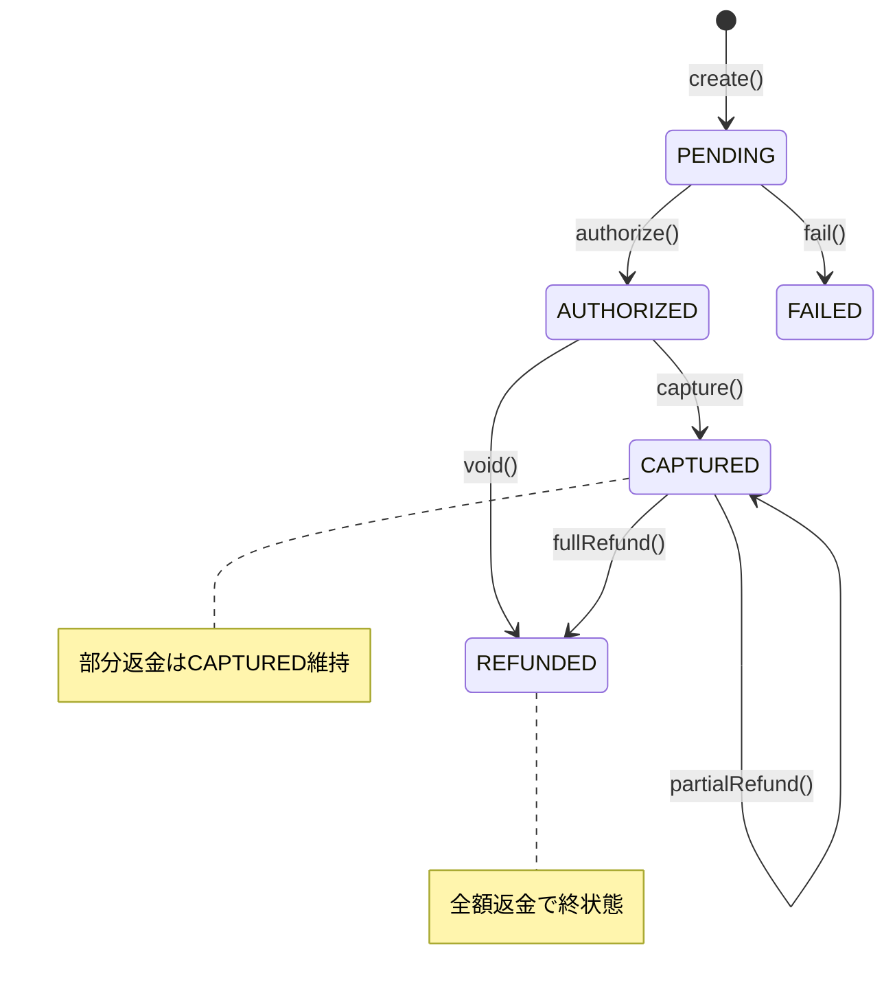

# 1. 目的 / 背景

## 目的
キャプチャ済み（CAPTURED）の支払いを返金し、顧客に資金を返却する。

## 背景
- 予約キャンセル時やサービス不履行時に返金が必要
- 返金は全額返金と部分返金の両方に対応
- 返金処理は冪等であるべき（リトライ時に二重返金を防ぐ）
- 返金は一度のみ、または複数回の部分返金が可能（設計次第）

## ユースケース概要
1. 予約キャンセル（BookingCancelledイベント）またはAPIリクエストを受信
2. 支払いがCAPTURED状態であることを確認
3. 外部決済ゲートウェイに返金リクエスト
4. 成功時：支払いをREFUNDED状態（または部分返金済み）に更新
5. PaymentRefundedイベントを発行

---

# 2. ユビキタス言語

- SSOT：`docs/domain/glossary.md`
- 主要用語：
  - **Payment**：予約に紐づく決済を表す集約
  - **PaymentStatus**：PENDING | AUTHORIZED | CAPTURED | REFUNDED | FAILED
  - **Refund**：キャプチャ済みの金額を顧客に返却する操作
  - **RefundedAmount**：返金済み金額（部分返金対応時に使用）
  - **FullRefund**：キャプチャ額と同額の返金
  - **PartialRefund**：キャプチャ額の一部の返金

---

# 3. 依存関係（Context Map）

```
┌─────────────────┐
│     Booking     │
│                 │
│ BookingCancelled│──────────────────┐
│  (CONFIRMED時)  │                  │
└─────────────────┘                  │
                                     ▼
┌─────────────────────────────────────────┐
│              Payment                     │
│                                          │
│  ・返金処理                              │
│  ・状態遷移（CAPTURED → REFUNDED）       │
│  ・外部ゲートウェイ連携                   │
└────────┬─────────────────┬──────────────┘
         │                 │
         │ PaymentRefunded │ PaymentRefundFailed
         ▼                 ▼
┌─────────────────┐     ┌─────────────┐     ┌─────────────┐
│ Payment Gateway │     │    Audit    │     │Notification │
│   (External)    │     │             │     │             │
│   ACL経由       │     │ 監査記録    │     │ 返金通知    │
└─────────────────┘     └─────────────┘     └─────────────┘
```

## 関係性

| 関係 | 種別 | 説明 |
|------|------|------|
| Booking → Payment | Publisher-Subscriber | BookingCancelled（previousStatus=CONFIRMED）でPaymentが返金処理を開始 |
| Payment → Gateway | Customer-Supplier (ACL) | 外部ゲートウェイとAnti-Corruption Layer経由で連携 |
| Payment → Audit | Publisher-Subscriber | PaymentRefundedイベントをAuditが購読して記録 |
| Payment → Notification | Publisher-Subscriber | PaymentRefundedで顧客に返金通知 |

---

# 4. 入出力（Command/Query/Event）

## Command: RefundPaymentCommand
```
RefundPaymentCommand {
  paymentId: UUID (required, from path)
  userId: UUID (from AccessToken)
  amount: Integer? (optional, for partial refund; omit for full refund)
  reason: String? (optional, max: 500)
}
```

## Response: Payment
```
Payment {
  id: UUID
  bookingId: UUID
  userId: UUID
  amount: Integer
  capturedAmount: Integer
  refundedAmount: Integer
  currency: String
  status: PaymentStatus ("REFUNDED" for full refund, "CAPTURED" for partial)
  description: String?
  gatewayTransactionId: String
  refundTransactionId: String?
  idempotencyKey: UUID
  refundedAt: DateTime?
  createdAt: DateTime
  updatedAt: DateTime
}
```

## Domain Event: PaymentRefunded
```
PaymentRefunded {
  eventId: UUID
  aggregateId: PaymentId
  occurredAt: DateTime
  payload: {
    paymentId: UUID
    bookingId: UUID
    userId: UUID
    refundedAmount: Integer
    totalRefundedAmount: Integer
    currency: String
    isFullRefund: Boolean
    reason: String?
    refundTransactionId: String
  }
}
```

**購読者：** Audit（監査記録）、Notification（返金完了通知）

## Domain Event: PaymentRefundFailed
```
PaymentRefundFailed {
  eventId: UUID
  aggregateId: PaymentId
  occurredAt: DateTime
  payload: {
    paymentId: UUID
    bookingId: UUID
    userId: UUID
    requestedAmount: Integer
    failureReason: String
    failedAt: DateTime
  }
}
```

**購読者：** Audit（監査記録）、Notification（返金失敗通知）

---

# 5. ドメインモデル（集約/不変条件）

## 集約：Payment（返金時の振る舞い）

```
Payment (Aggregate Root) {
  // 返金メソッド
  refund(amount: Integer?, reason: String?): Result<Payment, Error>
  
  // 返金可能額を計算
  refundableAmount(): Integer = capturedAmount - refundedAmount
}
```

## 不変条件

1. **返金可能な状態**：status == CAPTURED（部分返金中も含む）
2. **返金額は返金可能額以下**：requestedAmount <= refundableAmount()
3. **返金額は正の整数**：requestedAmount > 0
4. **全額返金後は再返金不可**：refundedAmount == capturedAmount の場合は追加返金不可

## 状態遷移



## 返金処理フロー

```
1. 支払いを取得
2. 所有者検証（payment.userId == token.userId）
   ├─ 不一致 → 403 Forbidden
   └─ 一致
       └─ 状態検証（status）
           ├─ REFUNDED → 200 OK (冪等：既存結果を返却)
           ├─ != CAPTURED → 422 Unprocessable Entity
           └─ CAPTURED
               ├─ 返金額を決定（指定なし→全額、指定あり→その額）
               ├─ 返金可能額検証（amount <= refundableAmount）
               ├─ 外部ゲートウェイに返金リクエスト
               │   ├─ 成功
               │   │   ├─ refundedAmount += amount
               │   │   ├─ 全額返金 → status = REFUNDED
               │   │   └─ 部分返金 → status = CAPTURED 維持
               │   └─ 失敗 → 適切なエラーレスポンス
               └─ PaymentRefundedイベントを発行
```

---

# 6. API（OpenAPI参照）

- SSOT：`docs/api/openapi/payment.yaml`
- エンドポイント：
  - `POST /payments/{id}/refund` - 返金

---

# 7. 永続化

## 返金更新クエリ（全額返金）

```sql
UPDATE payments
SET status = 'REFUNDED',
    refunded_amount = captured_amount,
    refund_transaction_id = :refundTransactionId,
    refunded_at = :now,
    updated_at = :now
WHERE id = :paymentId
  AND status = 'CAPTURED';
```

## 返金更新クエリ（部分返金）

```sql
UPDATE payments
SET refunded_amount = refunded_amount + :refundAmount,
    refund_transaction_id = :refundTransactionId,
    refunded_at = :now,
    updated_at = :now,
    status = CASE 
      WHEN refunded_amount + :refundAmount = captured_amount THEN 'REFUNDED'
      ELSE 'CAPTURED'
    END
WHERE id = :paymentId
  AND status = 'CAPTURED'
  AND refunded_amount + :refundAmount <= captured_amount;
```

**注意**：
- `WHERE ... AND refunded_amount + :refundAmount <= captured_amount` により過剰返金を防止
- 更新行数が0の場合は状態検証または返金額検証が必要

## refunds テーブル（返金履歴管理）

| カラム | 型 | 制約 | 説明 |
|--------|-----|------|------|
| id | UUID | PK | 返金ID |
| payment_id | UUID | FK(payments), NOT NULL | 支払いID |
| amount | INTEGER | NOT NULL | 返金額 |
| reason | VARCHAR(500) | NULL | 返金理由 |
| gateway_refund_id | VARCHAR(255) | NULL | ゲートウェイの返金ID |
| status | VARCHAR(20) | NOT NULL | SUCCESS/FAILED |
| created_at | TIMESTAMP | NOT NULL | 作成日時 |

**インデックス：**
- `idx_refunds_payment_id` ON refunds(payment_id) - 支払いの返金履歴検索

---

# 8. 失敗モードとリカバリ（timeout/retry/idempotency）

## 失敗モード一覧

| 失敗モード | HTTPステータス | 原因 | リカバリ |
|------------|----------------|------|----------|
| UNAUTHORIZED | 401 | AccessToken無効/期限切れ | トークンをリフレッシュして再試行 |
| FORBIDDEN | 403 | 支払いの所有者でない | 権限を確認 |
| NOT_FOUND | 404 | 支払いが見つからない | paymentIdを確認 |
| INVALID_STATE | 422 | CAPTURED以外の状態 | 現在の状態を確認 |
| ALREADY_REFUNDED | 422 | 既に全額返金済み | 返金不要 |
| EXCESS_REFUND | 422 | 返金可能額を超過 | 返金可能額を確認 |
| GATEWAY_ERROR | 502 | 外部決済ゲートウェイエラー | 指数バックオフでリトライ |
| GATEWAY_TIMEOUT | 504 | 外部決済ゲートウェイタイムアウト | 状態確認後にリトライ |

## Timeout設計

- **API全体のタイムアウト**：30秒
- **外部ゲートウェイ呼び出しのタイムアウト**：15秒
- **DB接続タイムアウト**：1秒

## Retry戦略

### クライアント側
- 502/504の場合：最大3回リトライ（指数バックオフ）
- 既にREFUNDED状態の場合は200で成功レスポンスを返却（冪等）

### サーバー側
- 外部ゲートウェイ呼び出し失敗：最大2回リトライ（指数バックオフ）

## Idempotency（冪等性）

- 全額返金済みの場合は200で既存結果を返却
- 部分返金は冪等ではない（同一リクエストで複数回返金される可能性）
  - 必要に応じてIdempotency-Keyを導入（未決事項）

---

# 9. 観測性（logs/metrics/traces）

## ログ

| イベント | ログレベル | 必須フィールド | 備考 |
|----------|------------|----------------|------|
| PaymentRefundAttempted | INFO | traceId, paymentId, userId, amount | - |
| PaymentRefunded | INFO | traceId, paymentId, refundedAmount, isFullRefund | - |
| PaymentRefundGatewayRequest | INFO | traceId, paymentId, gatewayName | - |
| PaymentRefundGatewayResponse | INFO | traceId, paymentId, status, refundTransactionId | - |
| PaymentRefundFailed | ERROR | traceId, paymentId, errorCode, errorMessage | - |
| PaymentAlreadyRefunded | INFO | traceId, paymentId | 冪等リクエスト検出 |

## メトリクス

| メトリクス名 | 型 | ラベル | 説明 |
|--------------|-----|--------|------|
| `payment_refund_total` | Counter | status=[success\|failed\|already_refunded], type=[full\|partial] | 返金試行数 |
| `payment_refund_duration_seconds` | Histogram | status | 返金処理時間 |
| `payment_refund_amount_total` | Counter | currency | 返金金額合計 |
| `payment_gateway_refund_total` | Counter | gateway, status | ゲートウェイ返金数 |
| `payment_gateway_refund_duration_seconds` | Histogram | gateway | ゲートウェイ応答時間 |

## トレース

- **SpanName**：`Payment.refund`
- **必須属性**：
  - `payment.id`
  - `payment.booking_id`
  - `payment.refunded_amount`
  - `payment.total_refunded_amount`
  - `payment.currency`
  - `payment.is_full_refund`
- **子Span**：
  - `Payment.validateState` - 状態検証
  - `Payment.calculateRefundable` - 返金可能額計算
  - `Payment.callGateway` - 外部ゲートウェイ呼び出し
  - `Payment.persist` - 永続化
  - `Payment.publishEvent` - イベント発行

---

# 10. セキュリティ（authn/authz/audit/PII）

## 認証（AuthN）

- 有効なAccessToken（JWT）が必要
- トークンからuserIdを抽出

## 認可（AuthZ）

| 操作 | 認可ルール |
|------|----------|
| 返金 | 支払いの所有者（payment.userId == token.userId） |

## 監査

- 返金操作を監査ログに記録
- 監査ログには以下を含める：
  - タイムスタンプ
  - 操作種別（REFUND）
  - ユーザーID
  - 支払いID
  - 返金額
  - 返金理由
  - 結果（success/failure）

## PII/PCI DSS保護

- カード情報は本システムで保持しない
- ゲートウェイのトークン化された情報のみ使用
- ログにセンシティブ情報を出力しない

---

# 11. テスト戦略（Unit/Integration/Contract/E2E）

## Unit Tests

| テスト対象 | テストケース |
|------------|-------------|
| Payment.refund | CAPTURED状態からの正常な全額返金 |
| Payment.refund | CAPTURED状態からの正常な部分返金 |
| Payment.refund | REFUNDED状態からの返金（冪等、成功を返す） |
| Payment.refund | AUTHORIZED状態からの返金拒否 |
| Payment.refund | 返金可能額を超える返金の拒否 |
| Payment.refundableAmount | 返金可能額の計算 |

## Integration Tests

| テスト対象 | テストケース |
|------------|-------------|
| PaymentRepository | 返金更新、部分返金の累積計算 |
| PaymentGatewayAdapter | 外部ゲートウェイとの返金連携（スタブ使用） |
| RefundPaymentUseCase | 正常返金、冪等性、ゲートウェイエラー |

## Contract Tests

- OpenAPI `payment.yaml` に対する契約テスト
- POST /payments/{id}/refund のレスポンス形式検証
- 全額返金と部分返金のレスポンス差異検証

## E2E Tests

| シナリオ | 検証内容 |
|----------|----------|
| 全額返金フロー | 支払い作成 → キャプチャ → 全額返金 → REFUNDED確認 |
| 部分返金フロー | キャプチャ → 部分返金 → CAPTURED維持確認 |
| 複数回部分返金 | 部分返金 × N回 → 累積返金額確認 |
| 冪等返金 | 全額返金 → 同一支払いで再返金 → 200 |
| 権限検証 | 他ユーザーの支払い返金 → 403 |
| 予約キャンセル連携 | BookingCancelled → 自動返金トリガー確認 |

## 境界値テスト

- 返金額の境界（capturedAmount - refundedAmount と同額、超過）
- 部分返金後の残額（1円残り、0円残り）
- 返金理由の最大長（500文字）

---

# 12. ADRリンク

- ADR-009: 支払いステータス遷移の設計（作成予定）
- ADR-013: 部分返金の設計（作成予定）
- ADR-014: 返金トリガーの設計（手動 vs 自動）（作成予定）

---

# 13. Evidence（根拠）

| 項目 | 根拠 | 備考 |
|------|------|------|
| 全額返金後のREFUNDED遷移 | Stripe, PayPal等の標準パターン | 終状態として明確化 |
| 部分返金中のCAPTURED維持 | 追加返金の可能性を考慮 | 設計判断 |
| 返金履歴テーブル | 複数回返金の追跡、監査要件 | 推論、運用で検証が必要 |
| 全額返金の冪等性 | 決済システムのベストプラクティス | リトライ時の二重返金防止 |

---

# 14. 未決事項

| 項目 | 内容 | 優先度 |
|------|------|--------|
| 部分返金のIdempotency-Key | 部分返金の冪等性をどう担保するか | 中 |
| 自動返金トリガー | BookingCancelledイベントからの自動返金設計 | 高 |
| 返金期限 | キャプチャからN日後まで返金可能といった制限 | 中 |
| 返金手数料 | 返金時の手数料をどう扱うか | 低 |
| 返金理由のカテゴリ | 定型的な返金理由の分類 | 低 |
| 管理者返金 | 運営者による強制返金機能 | 中 |
